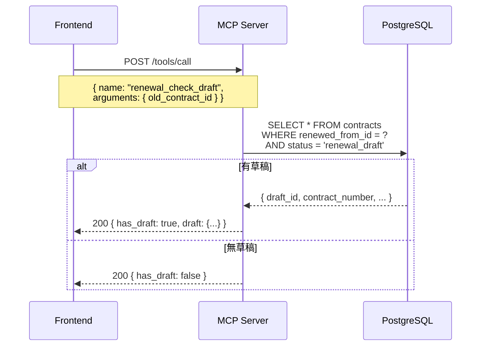
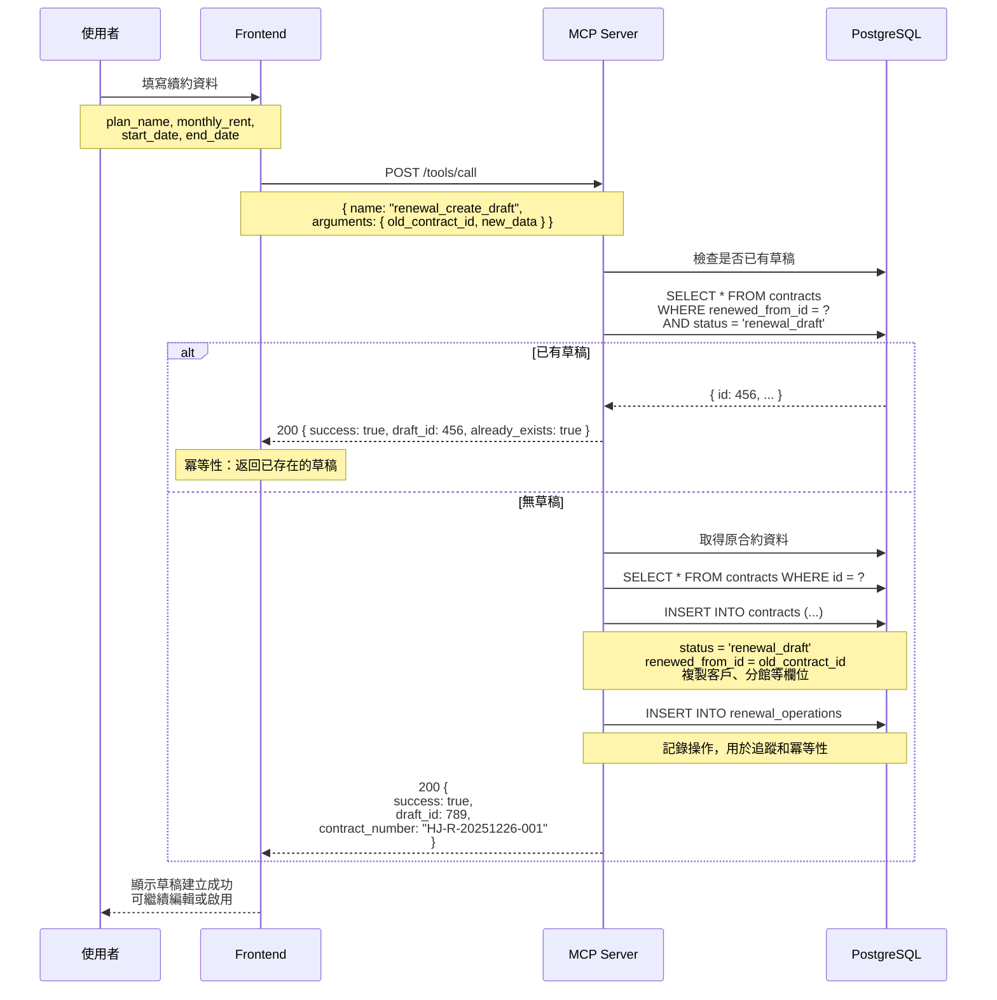
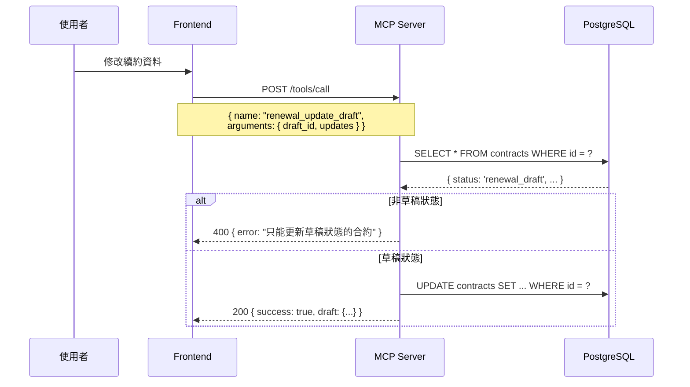
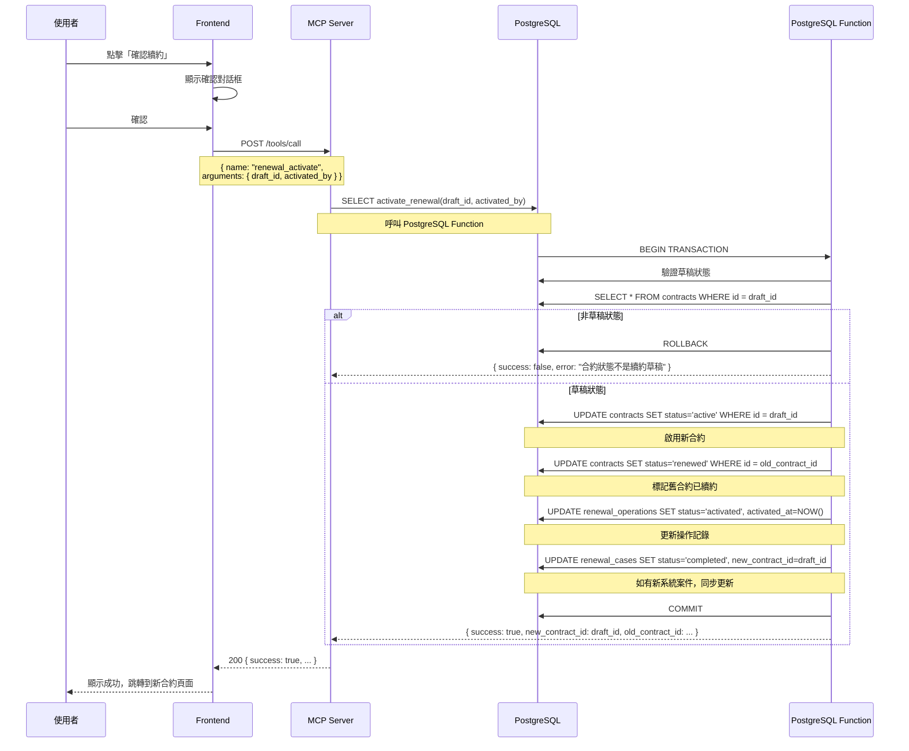
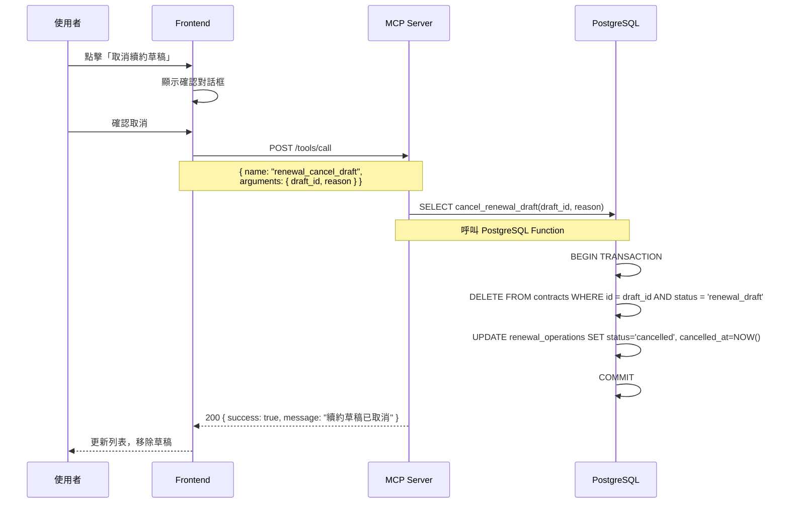
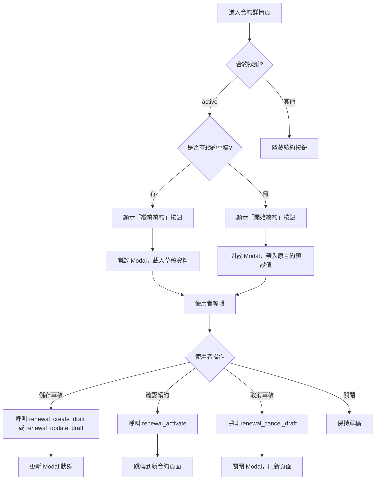
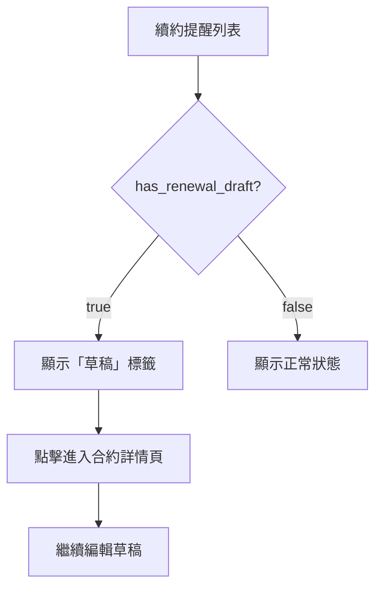

# SSD v1.5 - Renewal Domain V2（草稿機制）

> Version: 1.5
> Date: 2025-12-26
> Purpose: 定義續約流程的兩階段提交機制，解決 Timeout 造成的資料不一致問題

---

## 1. 概述

### 1.1 問題背景

原有的 `renewal_complete` 直接建立新合約並更新舊合約狀態，如果 Timeout 會造成：
- 兩份 active 合約（重複產生應收帳款）
- 或舊合約已 renewed 但新合約未建立（無有效合約）

### 1.2 解決方案

採用**兩階段提交**：
1. **Stage 1**：建立 `renewal_draft` 狀態的新合約（安全，可 Timeout 恢復）
2. **Stage 2**：呼叫 PostgreSQL Function 原子性啟用（Transaction 保護）

---

## 2. 新增資料結構

### 2.1 contracts 表擴展

```sql
-- 新增狀態
ALTER TABLE contracts ADD CONSTRAINT contracts_status_check
    CHECK (status IN (
        'draft',
        'active',
        'expired',
        'terminated',
        'renewed',
        'pending_termination',
        'renewal_draft'       -- 新增：續約草稿
    ));

-- 新增欄位
ALTER TABLE contracts ADD COLUMN renewed_from_id INT REFERENCES contracts(id);
```

### 2.2 renewal_operations 表（冪等性保護）

```sql
CREATE TABLE renewal_operations (
    id                  SERIAL PRIMARY KEY,
    idempotency_key     VARCHAR(64) UNIQUE,
    old_contract_id     INT NOT NULL REFERENCES contracts(id),
    new_contract_id     INT REFERENCES contracts(id),
    status              VARCHAR(20) DEFAULT 'draft'
                        CHECK (status IN ('draft', 'activated', 'cancelled')),
    created_at          TIMESTAMPTZ DEFAULT NOW(),
    activated_at        TIMESTAMPTZ,
    cancelled_at        TIMESTAMPTZ,
    created_by          TEXT,
    activated_by        TEXT
);
```

---

## 3. 新增 MCP Tools

### 3.1 renewal_check_draft（檢查草稿）



**API 規格**

```yaml
Endpoint: POST /tools/call
Request:
  name: renewal_check_draft
  arguments:
    old_contract_id: integer (required)

Response:
  has_draft: boolean
  draft:
    id: integer
    contract_number: string
    plan_name: string
    monthly_rent: decimal
    start_date: date
    end_date: date
    created_at: datetime
```

---

### 3.2 renewal_create_draft（建立草稿）



**API 規格**

```yaml
Endpoint: POST /tools/call
Request:
  name: renewal_create_draft
  arguments:
    old_contract_id: integer (required)
    new_data:
      plan_name: string (optional, default: 原方案)
      monthly_rent: decimal (optional, default: 原租金)
      start_date: date (optional, default: 原合約到期日+1)
      end_date: date (optional, default: 起始日+1年)
      payment_cycle: integer (optional, default: 原週期)
      position_number: integer (optional, default: 原座位)
      notes: string (optional)
    idempotency_key: string (optional)
    created_by: string (optional)

Response (success):
  success: true
  draft_id: integer
  contract_number: string
  already_exists: boolean

Response (error):
  success: false
  error: string
  code: "OLD_CONTRACT_NOT_FOUND" | "OLD_CONTRACT_NOT_ACTIVE" | ...
```

---

### 3.3 renewal_update_draft（更新草稿）



**API 規格**

```yaml
Endpoint: POST /tools/call
Request:
  name: renewal_update_draft
  arguments:
    draft_id: integer (required)
    updates:
      plan_name: string
      monthly_rent: decimal
      start_date: date
      end_date: date
      payment_cycle: integer
      notes: string

Response:
  success: true
  draft: { ... }
```

---

### 3.4 renewal_activate（啟用草稿）



**API 規格**

```yaml
Endpoint: POST /tools/call
Request:
  name: renewal_activate
  arguments:
    draft_id: integer (required)
    activated_by: string (optional)

Response (success):
  success: true
  new_contract_id: integer
  old_contract_id: integer
  message: "續約啟用成功"

Response (error):
  success: false
  error: string
  code: "DRAFT_NOT_FOUND" | "INVALID_STATUS" | "OLD_CONTRACT_NOT_FOUND" | ...
```

---

### 3.5 renewal_cancel_draft（取消草稿）



**API 規格**

```yaml
Endpoint: POST /tools/call
Request:
  name: renewal_cancel_draft
  arguments:
    draft_id: integer (required)
    reason: string (optional)

Response:
  success: true
  deleted_contract_id: integer
  message: "續約草稿已取消"
```

---

## 4. 前端流程

### 4.1 合約詳情頁續約按鈕



### 4.2 續約列表頁



---

## 5. 視圖更新

### 5.1 v_renewal_reminders（續約提醒視圖）

```sql
CREATE OR REPLACE VIEW v_renewal_reminders AS
SELECT
    ct.id AS contract_id,
    ct.contract_number,
    -- ... 原有欄位 ...

    -- 新增：是否有續約草稿
    EXISTS (
        SELECT 1 FROM contracts c2
        WHERE c2.renewed_from_id = ct.id
          AND c2.status IN ('active', 'renewal_draft')
    ) AS has_renewal_draft

FROM contracts ct
JOIN customers c ON ct.customer_id = c.id
JOIN branches b ON ct.branch_id = b.id
WHERE ct.status = 'active'
  AND ct.end_date <= CURRENT_DATE + INTERVAL '90 days'
  AND ct.end_date >= CURRENT_DATE - INTERVAL '30 days'
  -- ★ 排除已有續約草稿或新合約的
  AND NOT EXISTS (
      SELECT 1 FROM contracts c2
      WHERE c2.renewed_from_id = ct.id
        AND c2.status IN ('active', 'renewal_draft')
  )
  -- ★ 排除已標記簽約完成的（舊系統相容）
  AND ct.renewal_signed_at IS NULL
ORDER BY ct.end_date ASC;
```

---

## 6. 錯誤碼定義

| Code | HTTP Status | 說明 |
|------|-------------|------|
| `DRAFT_NOT_FOUND` | 404 | 找不到續約草稿 |
| `INVALID_STATUS` | 400 | 操作不符合當前狀態 |
| `OLD_CONTRACT_NOT_FOUND` | 404 | 原合約不存在 |
| `OLD_CONTRACT_NOT_ACTIVE` | 400 | 原合約非 active 狀態 |
| `DRAFT_ALREADY_EXISTS` | 200 | 草稿已存在（冪等性，不視為錯誤） |
| `ACTIVATION_FAILED` | 500 | 啟用失敗（Transaction rollback） |

---

## 7. MCP Tools 彙整

| Tool Name | 說明 | 新增/修改 |
|-----------|------|-----------|
| `renewal_check_draft` | 檢查合約是否有續約草稿 | 新增 |
| `renewal_create_draft` | 建立續約草稿（Stage 1） | 新增 |
| `renewal_update_draft` | 更新續約草稿 | 新增 |
| `renewal_activate` | 啟用續約草稿（Stage 2） | 新增 |
| `renewal_cancel_draft` | 取消續約草稿 | 新增 |
| `renewal_complete` | 舊版完成續約 | 保留相容 |

---

## 8. 欄位保護機制

### 8.1 DB Trigger 保護

為防止直接透過 PostgREST PATCH 修改 `contracts.status` 和 `renewed_from_id`，新增 DB Trigger：

```sql
-- 043_protect_contract_status.sql
CREATE TRIGGER tr_protect_contract_critical_fields
    BEFORE UPDATE ON contracts
    FOR EACH ROW
    EXECUTE FUNCTION protect_contract_critical_fields();
```

### 8.2 白名單機制

PostgreSQL Function 需要修改這些欄位時，透過 `set_config` 設定 session variable 繞過 Trigger：

```sql
-- 在 Function 開頭加入
PERFORM set_config('app.from_rpc', 'true', true);
```

### 8.3 受影響的 Functions

| Function | 說明 |
|----------|------|
| `activate_renewal` | 啟用續約草稿 |
| `cancel_renewal_draft` | 取消續約草稿 |
| `activate_termination_case` | 啟用解約案件 |
| `complete_termination` | 完成解約 |
| `cancel_termination_case` | 取消解約案件 |

---

## 附錄：Timeout 場景測試

### 場景 A：Stage 1 Timeout

```
1. 使用者點擊「儲存草稿」
2. renewal_create_draft 呼叫成功
3. 回應還沒返回，網路 Timeout
4. 使用者按 F5 刷新

預期結果：
- 草稿存在於資料庫
- 重新載入頁面可看到草稿
- 再次呼叫 renewal_create_draft 返回已存在的草稿（冪等性）
```

### 場景 B：Stage 2 Timeout

```
1. 使用者點擊「確認續約」
2. renewal_activate 呼叫，PostgreSQL Function 執行
3. 回應還沒返回，網路 Timeout
4. 使用者按 F5 刷新

預期結果 (成功案例)：
- Function 已執行成功
- 新合約為 active，舊合約為 renewed
- 重新載入頁面看到續約已完成

預期結果 (失敗案例)：
- Function rollback（網路斷開前 DB 連線也斷）
- 草稿仍為 renewal_draft
- 舊合約仍為 active
- 可再次點擊啟用
```

### 場景 C：並發操作

```
1. 使用者 A 和使用者 B 同時操作同一份合約
2. A 建立草稿成功
3. B 嘗試建立草稿

預期結果：
- B 收到 A 建立的草稿 ID（冪等性）
- 不會建立重複草稿
```
