# System Sequence Diagram (SSD)

> 系統序列圖 - 定義 API 互動規格
> Version: 1.4
> Last Updated: 2024-12-25
>
> **v1.4 變更**：
> - 新增 Customer Domain（客戶管理）
> - 新增 Booking Domain（會議室預約）
> - 新增 Quote Domain（報價單管理）
> - 新增 LegalLetter Domain（存證信函）
>
> **v1.3 變更**：
> - 新增 Termination Domain（解約流程管理）
> - 新增 7 個 termination_* MCP tools
>
> **v1.2 變更**：
> - WaivePayment Approve 失敗改用 409 Conflict
> - IssueInvoice 存 contract_id，用 payment_invoices 關聯表
> - BatchReminder 查詢用 PostgREST embed
> - RecordPayment 補上金額驗證（MVP 嚴格模式）
>
> **v1.1 變更**：
> - 修正 CancelRenewal 的資源釋放（改用 reservation 而非 status）
> - 修正 TerminateContract 的 payments 處理（cancelled 而非 DELETE）
> - 統一 Tool naming（LINE 操作收斂到 domain command）
> - 補充 RecordPayment 與 Invoice 的關係說明

---

## 目錄

1. [Billing Domain](#1-billing-domain)
   - 1.1 RecordPayment
   - 1.2 WaivePayment (含審批)
   - 1.3 UndoPayment
   - 1.4 SendReminder
   - 1.5 BatchReminder
2. [Renewal Domain](#2-renewal-domain)
   - 2.1 CreateRenewalCase
   - 2.2 SendNotification
   - 2.3 ConfirmIntent
   - 2.4 CancelRenewal
   - 2.5 CompleteRenewal
3. [Contract Domain](#3-contract-domain)
   - 3.1 CreateContract
   - 3.2 TerminateContract
   - 3.3 QueryContractDetail
4. [Invoice Domain](#4-invoice-domain)
   - 4.1 IssueInvoice
   - 4.2 VoidInvoice
5. [Termination Domain](#5-termination-domain)
   - 5.1 CreateTerminationCase
   - 5.2 UpdateTerminationStatus
   - 5.3 UpdateChecklist
   - 5.4 CalculateSettlement
   - 5.5 ProcessRefund
   - 5.6 CancelTermination
6. [Customer Domain](#6-customer-domain)
   - 6.1 CreateCustomer
   - 6.2 UpdateCustomer
   - 6.3 LinkLineUser
7. [Booking Domain](#7-booking-domain)
   - 7.1 CreateBooking
   - 7.2 CancelBooking
   - 7.3 CheckInBooking
8. [Quote Domain](#8-quote-domain)
   - 8.1 CreateQuote
   - 8.2 SendQuote
   - 8.3 ConvertQuoteToContract
9. [LegalLetter Domain](#9-legalletter-domain)
   - 9.1 CreateLegalLetter
   - 9.2 SendLegalLetter

---

## 1. Billing Domain

### 1.1 RecordPayment（記錄繳費）

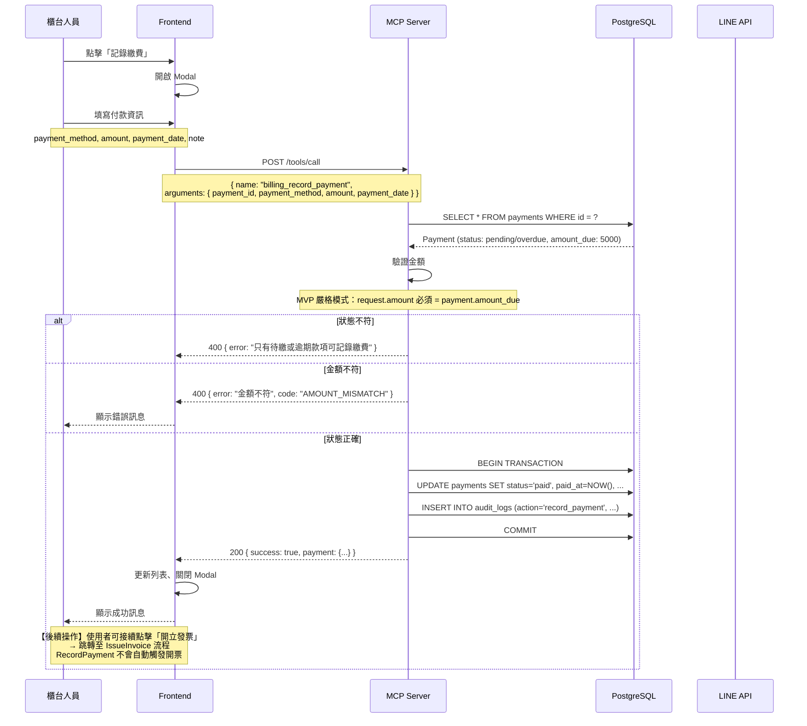
```mermaid
sequenceDiagram
    participant U as 櫃台人員
    participant FE as Frontend
    participant API as MCP Server
    participant DB as PostgreSQL
    participant LINE as LINE API

    U->>FE: 點擊「記錄繳費」
    FE->>FE: 開啟 Modal
    U->>FE: 填寫付款資訊
    Note over U,FE: payment_method, amount, payment_date, note

    FE->>API: POST /tools/call
    Note over FE,API: { name: "billing_record_payment",<br/>arguments: { payment_id, payment_method, amount, payment_date } }

    API->>DB: SELECT * FROM payments WHERE id = ?
    DB-->>API: Payment (status: pending/overdue, amount_due: 5000)

    API->>API: 驗證金額
    Note over API: MVP 嚴格模式：request.amount 必須 = payment.amount_due

    alt 狀態不符
        API-->>FE: 400 { error: "只有待繳或逾期款項可記錄繳費" }
    else 金額不符
        API-->>FE: 400 { error: "金額不符", code: "AMOUNT_MISMATCH" }
        FE-->>U: 顯示錯誤訊息
    else 狀態正確
        API->>DB: BEGIN TRANSACTION
        API->>DB: UPDATE payments SET status='paid', paid_at=NOW(), ...
        API->>DB: INSERT INTO audit_logs (action='record_payment', ...)
        API->>DB: COMMIT

        API-->>FE: 200 { success: true, payment: {...} }
        FE->>FE: 更新列表、關閉 Modal
        FE-->>U: 顯示成功訊息

        Note over U,FE: 【後續操作】使用者可接續點擊「開立發票」<br/>→ 跳轉至 IssueInvoice 流程<br/>RecordPayment 不會自動觸發開票
    end
```

> **重要說明**：RecordPayment 與 IssueInvoice 是**獨立操作**。
> - 繳費成功不會自動開票
> - 使用者需手動點擊「開立發票」
> - 這符合實務：現金客戶可能不需要發票

**API 規格**

```yaml
Endpoint: POST /tools/call
Request:
  name: billing_record_payment
  arguments:
    payment_id: integer (required)
    payment_method: enum [cash, transfer, credit_card, line_pay] (required)
    amount: decimal (required)
    payment_date: date (required, default: today)
    note: string (optional)

Response (success):
  status: 200
  body:
    success: true
    payment:
      id: integer
      status: "paid"
      paid_at: datetime
      payment_method: string

Response (error):
  status: 400
  body:
    error: string
    code: "INVALID_STATUS" | "AMOUNT_MISMATCH" | ...
```

---

### 1.2 WaivePayment（免收 - 含審批）

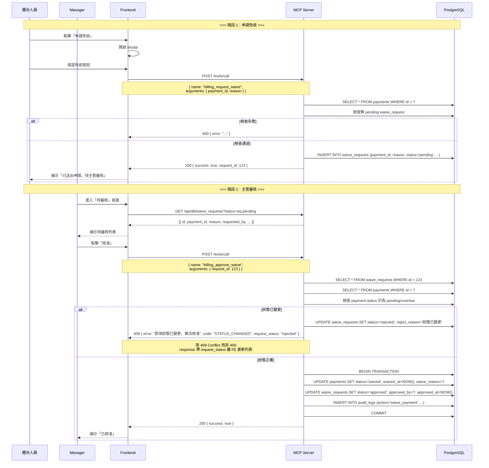
```mermaid
sequenceDiagram
    participant S as 櫃台人員
    participant M as Manager
    participant FE as Frontend
    participant API as MCP Server
    participant DB as PostgreSQL

    Note over S,DB: === 階段 1：申請免收 ===

    S->>FE: 點擊「申請免收」
    FE->>FE: 開啟 Modal
    S->>FE: 填寫免收原因
    FE->>API: POST /tools/call
    Note over FE,API: { name: "billing_request_waive",<br/>arguments: { payment_id, reason } }

    API->>DB: SELECT * FROM payments WHERE id = ?
    API->>DB: 檢查無 pending waive_request

    alt 檢查失敗
        API-->>FE: 400 { error: "..." }
    else 檢查通過
        API->>DB: INSERT INTO waive_requests (payment_id, reason, status='pending', ...)
        API-->>FE: 200 { success: true, request_id: 123 }
        FE-->>S: 顯示「已送出申請，待主管審核」
    end

    Note over S,DB: === 階段 2：主管審核 ===

    M->>FE: 進入「待審核」頁面
    FE->>API: GET /api/db/waive_requests?status=eq.pending
    API-->>FE: [{ id, payment_id, reason, requested_by, ... }]
    FE-->>M: 顯示待審核列表

    M->>FE: 點擊「核准」
    FE->>API: POST /tools/call
    Note over FE,API: { name: "billing_approve_waive",<br/>arguments: { request_id: 123 } }

    API->>DB: SELECT * FROM waive_requests WHERE id = 123
    API->>DB: SELECT * FROM payments WHERE id = ?
    API->>DB: 檢查 payment.status 仍為 pending/overdue

    alt 狀態已變更
        API->>DB: UPDATE waive_requests SET status='rejected', reject_reason='狀態已變更'
        API-->>FE: 409 { error: "款項狀態已變更，無法核准", code: "STATUS_CHANGED", request_status: "rejected" }
        Note over API,FE: 用 409 Conflict 而非 400<br/>response 帶 request_status 讓 FE 更新列表
    else 狀態正確
        API->>DB: BEGIN TRANSACTION
        API->>DB: UPDATE payments SET status='waived', waived_at=NOW(), waive_reason=?
        API->>DB: UPDATE waive_requests SET status='approved', approved_by=?, approved_at=NOW()
        API->>DB: INSERT INTO audit_logs (action='waive_payment', ...)
        API->>DB: COMMIT
        API-->>FE: 200 { success: true }
        FE-->>M: 顯示「已核准」
    end
```

**API 規格**

```yaml
# 申請免收
Endpoint: POST /tools/call
Request:
  name: billing_request_waive
  arguments:
    payment_id: integer (required)
    reason: string (required, min: 10 chars)

Response:
  success: true
  request_id: integer

---

# 核准免收
Endpoint: POST /tools/call
Request:
  name: billing_approve_waive
  arguments:
    request_id: integer (required)

Response:
  success: true

---

# 駁回免收
Endpoint: POST /tools/call
Request:
  name: billing_reject_waive
  arguments:
    request_id: integer (required)
    reject_reason: string (required)

Response:
  success: true
```

---

### 1.3 UndoPayment（撤銷繳費）

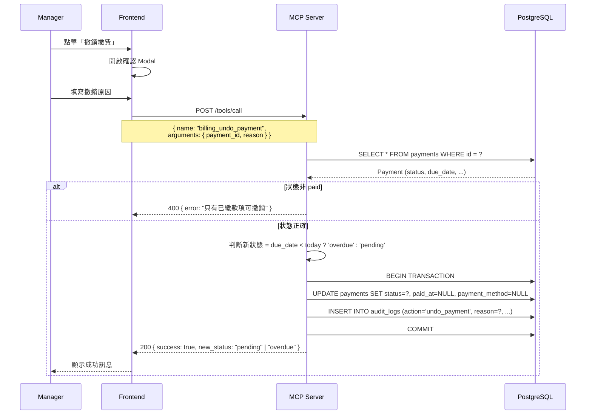
```mermaid
sequenceDiagram
    participant M as Manager
    participant FE as Frontend
    participant API as MCP Server
    participant DB as PostgreSQL

    M->>FE: 點擊「撤銷繳費」
    FE->>FE: 開啟確認 Modal
    M->>FE: 填寫撤銷原因
    FE->>API: POST /tools/call
    Note over FE,API: { name: "billing_undo_payment",<br/>arguments: { payment_id, reason } }

    API->>DB: SELECT * FROM payments WHERE id = ?
    DB-->>API: Payment (status, due_date, ...)

    alt 狀態非 paid
        API-->>FE: 400 { error: "只有已繳款項可撤銷" }
    else 狀態正確
        API->>API: 判斷新狀態 = due_date < today ? 'overdue' : 'pending'
        API->>DB: BEGIN TRANSACTION
        API->>DB: UPDATE payments SET status=?, paid_at=NULL, payment_method=NULL
        API->>DB: INSERT INTO audit_logs (action='undo_payment', reason=?, ...)
        API->>DB: COMMIT
        API-->>FE: 200 { success: true, new_status: "pending" | "overdue" }
        FE-->>M: 顯示成功訊息
    end
```

---

### 1.4 SendReminder（發送催繳）

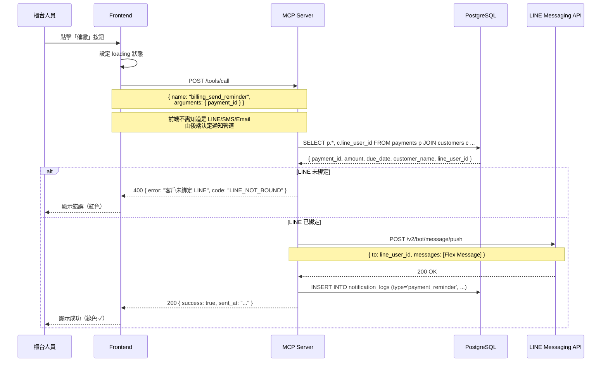
```mermaid
sequenceDiagram
    participant U as 櫃台人員
    participant FE as Frontend
    participant API as MCP Server
    participant DB as PostgreSQL
    participant LINE as LINE Messaging API

    U->>FE: 點擊「催繳」按鈕
    FE->>FE: 設定 loading 狀態

    FE->>API: POST /tools/call
    Note over FE,API: { name: "billing_send_reminder",<br/>arguments: { payment_id } }
    Note over FE,API: 前端不需知道是 LINE/SMS/Email<br/>由後端決定通知管道

    API->>DB: SELECT p.*, c.line_user_id FROM payments p JOIN customers c ...
    DB-->>API: { payment_id, amount, due_date, customer_name, line_user_id }

    alt LINE 未綁定
        API-->>FE: 400 { error: "客戶未綁定 LINE", code: "LINE_NOT_BOUND" }
        FE-->>U: 顯示錯誤（紅色）
    else LINE 已綁定
        API->>LINE: POST /v2/bot/message/push
        Note over API,LINE: { to: line_user_id, messages: [Flex Message] }
        LINE-->>API: 200 OK

        API->>DB: INSERT INTO notification_logs (type='payment_reminder', ...)
        API-->>FE: 200 { success: true, sent_at: "..." }
        FE-->>U: 顯示成功（綠色 ✓）
    end
```

---

### 1.5 BatchReminder（批量催繳）

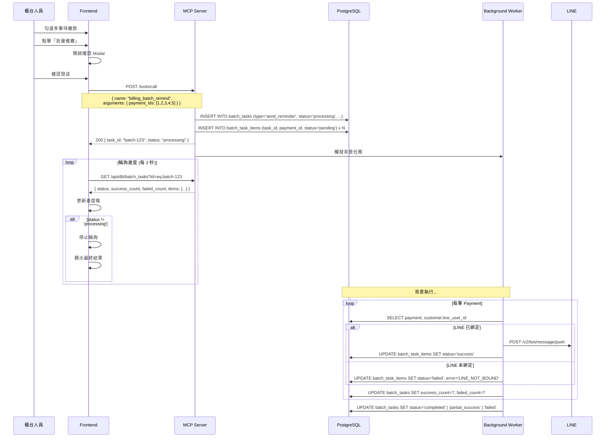
```mermaid
sequenceDiagram
    participant U as 櫃台人員
    participant FE as Frontend
    participant API as MCP Server
    participant DB as PostgreSQL
    participant BG as Background Worker

    U->>FE: 勾選多筆待繳款
    U->>FE: 點擊「批量催繳」
    FE->>FE: 開啟確認 Modal

    U->>FE: 確認發送
    FE->>API: POST /tools/call
    Note over FE,API: { name: "billing_batch_remind",<br/>arguments: { payment_ids: [1,2,3,4,5] } }

    API->>DB: INSERT INTO batch_tasks (type='send_reminder', status='processing', ...)
    API->>DB: INSERT INTO batch_task_items (task_id, payment_id, status='pending') x N
    API-->>FE: 200 { task_id: "batch-123", status: "processing" }

    API->>BG: 觸發背景任務

    loop 輪詢進度 (每 2 秒)
        FE->>API: GET /api/db/batch_tasks?id=eq.batch-123
        API-->>FE: { status, success_count, failed_count, items: [...] }
        FE->>FE: 更新進度條

        alt status != 'processing'
            FE->>FE: 停止輪詢
            FE->>FE: 顯示最終結果
        end
    end

    Note over BG,DB: 背景執行...
    loop 每筆 Payment
        BG->>DB: SELECT payment, customer.line_user_id
        alt LINE 已綁定
            BG->>LINE: POST /v2/bot/message/push
            BG->>DB: UPDATE batch_task_items SET status='success'
        else LINE 未綁定
            BG->>DB: UPDATE batch_task_items SET status='failed', error='LINE_NOT_BOUND'
        end
        BG->>DB: UPDATE batch_tasks SET success_count=?, failed_count=?
    end
    BG->>DB: UPDATE batch_tasks SET status='completed' | 'partial_success' | 'failed'
```

**API 規格**

```yaml
# 建立批量任務
Endpoint: POST /tools/call
Request:
  name: billing_batch_remind
  arguments:
    payment_ids: array[integer] (required, max: 100)

Response:
  task_id: string
  status: "processing"
  total_count: integer

---

# 查詢批量任務進度（使用 PostgREST embed）
Endpoint: GET /api/db/batch_tasks?id=eq.{task_id}&select=*,items:batch_task_items(*)

Response:
  - id: string
    type: string
    status: "processing" | "completed" | "partial_success" | "failed"
    total_count: integer
    success_count: integer
    failed_count: integer
    items:  # 透過 embed 一次查回
      - target_id: string
        status: "pending" | "success" | "failed"
        error: string | null
```

---

## 2. Renewal Domain

### 2.1 CreateRenewalCase（系統自動建立）

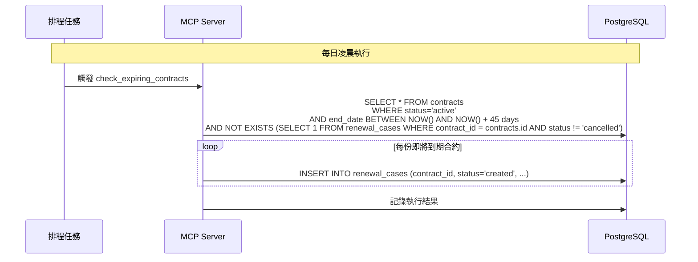
```mermaid
sequenceDiagram
    participant CRON as 排程任務
    participant API as MCP Server
    participant DB as PostgreSQL

    Note over CRON,DB: 每日凌晨執行

    CRON->>API: 觸發 check_expiring_contracts

    API->>DB: SELECT * FROM contracts<br/>WHERE status='active'<br/>AND end_date BETWEEN NOW() AND NOW() + 45 days<br/>AND NOT EXISTS (SELECT 1 FROM renewal_cases WHERE contract_id = contracts.id AND status != 'cancelled')

    loop 每份即將到期合約
        API->>DB: INSERT INTO renewal_cases (contract_id, status='created', ...)
    end

    API->>DB: 記錄執行結果
```

---

### 2.2 SendNotification（發送續約通知）

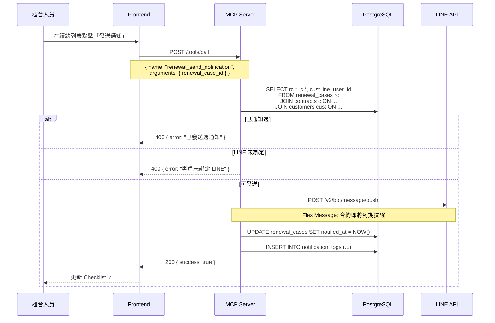
```mermaid
sequenceDiagram
    participant U as 櫃台人員
    participant FE as Frontend
    participant API as MCP Server
    participant DB as PostgreSQL
    participant LINE as LINE API

    U->>FE: 在續約列表點擊「發送通知」
    FE->>API: POST /tools/call
    Note over FE,API: { name: "renewal_send_notification",<br/>arguments: { renewal_case_id } }

    API->>DB: SELECT rc.*, c.*, cust.line_user_id<br/>FROM renewal_cases rc<br/>JOIN contracts c ON ...<br/>JOIN customers cust ON ...

    alt 已通知過
        API-->>FE: 400 { error: "已發送過通知" }
    else LINE 未綁定
        API-->>FE: 400 { error: "客戶未綁定 LINE" }
    else 可發送
        API->>LINE: POST /v2/bot/message/push
        Note over API,LINE: Flex Message: 合約即將到期提醒

        API->>DB: UPDATE renewal_cases SET notified_at = NOW()
        API->>DB: INSERT INTO notification_logs (...)
        API-->>FE: 200 { success: true }
        FE-->>U: 更新 Checklist ✓
    end
```

---

### 2.3 ConfirmIntent（確認續約意願）

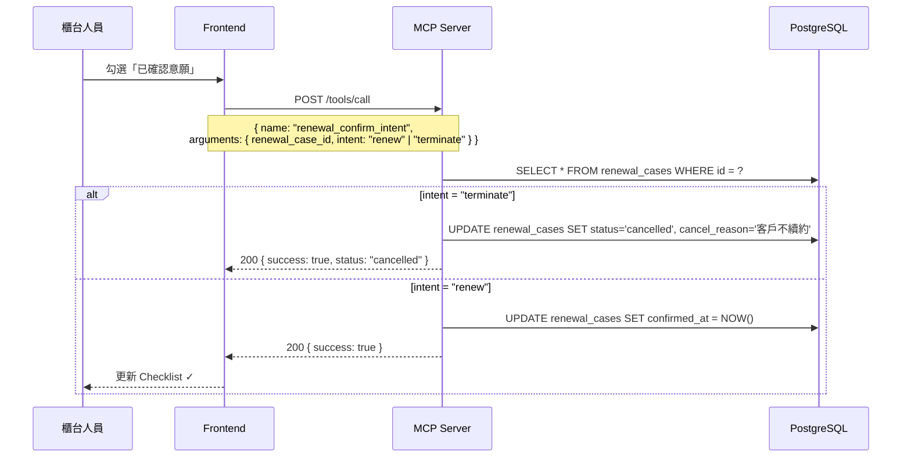
```mermaid
sequenceDiagram
    participant U as 櫃台人員
    participant FE as Frontend
    participant API as MCP Server
    participant DB as PostgreSQL

    U->>FE: 勾選「已確認意願」
    FE->>API: POST /tools/call
    Note over FE,API: { name: "renewal_confirm_intent",<br/>arguments: { renewal_case_id, intent: "renew" | "terminate" } }

    API->>DB: SELECT * FROM renewal_cases WHERE id = ?

    alt intent = "terminate"
        API->>DB: UPDATE renewal_cases SET status='cancelled', cancel_reason='客戶不續約'
        API-->>FE: 200 { success: true, status: "cancelled" }
    else intent = "renew"
        API->>DB: UPDATE renewal_cases SET confirmed_at = NOW()
        API-->>FE: 200 { success: true }
        FE-->>U: 更新 Checklist ✓
    end
```

---

### 2.4 CancelRenewal（取消續約）

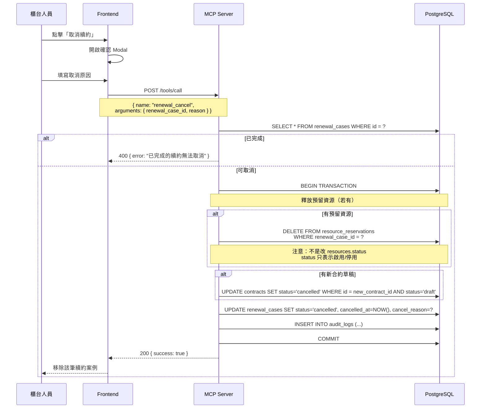
```mermaid
sequenceDiagram
    participant U as 櫃台人員
    participant FE as Frontend
    participant API as MCP Server
    participant DB as PostgreSQL

    U->>FE: 點擊「取消續約」
    FE->>FE: 開啟確認 Modal
    U->>FE: 填寫取消原因

    FE->>API: POST /tools/call
    Note over FE,API: { name: "renewal_cancel",<br/>arguments: { renewal_case_id, reason } }

    API->>DB: SELECT * FROM renewal_cases WHERE id = ?

    alt 已完成
        API-->>FE: 400 { error: "已完成的續約無法取消" }
    else 可取消
        API->>DB: BEGIN TRANSACTION

        Note over API,DB: 釋放預留資源（若有）
        alt 有預留資源
            API->>DB: DELETE FROM resource_reservations<br/>WHERE renewal_case_id = ?
            Note over API,DB: 注意：不是改 resources.status<br/>status 只表示啟用/停用
        end

        alt 有新合約草稿
            API->>DB: UPDATE contracts SET status='cancelled' WHERE id = new_contract_id AND status='draft'
        end

        API->>DB: UPDATE renewal_cases SET status='cancelled', cancelled_at=NOW(), cancel_reason=?
        API->>DB: INSERT INTO audit_logs (...)
        API->>DB: COMMIT

        API-->>FE: 200 { success: true }
        FE-->>U: 移除該筆續約案例
    end
```

---

### 2.5 CompleteRenewal（完成續約 - 簽訂新約）

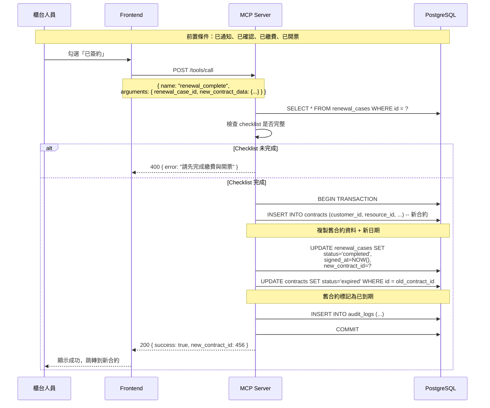
```mermaid
sequenceDiagram
    participant U as 櫃台人員
    participant FE as Frontend
    participant API as MCP Server
    participant DB as PostgreSQL

    Note over U,DB: 前置條件：已通知、已確認、已繳費、已開票

    U->>FE: 勾選「已簽約」
    FE->>API: POST /tools/call
    Note over FE,API: { name: "renewal_complete",<br/>arguments: { renewal_case_id, new_contract_data: {...} } }

    API->>DB: SELECT * FROM renewal_cases WHERE id = ?
    API->>API: 檢查 checklist 是否完整

    alt Checklist 未完成
        API-->>FE: 400 { error: "請先完成繳費與開票" }
    else Checklist 完成
        API->>DB: BEGIN TRANSACTION

        API->>DB: INSERT INTO contracts (customer_id, resource_id, ...) -- 新合約
        Note over API,DB: 複製舊合約資料 + 新日期

        API->>DB: UPDATE renewal_cases SET<br/>status='completed',<br/>signed_at=NOW(),<br/>new_contract_id=?

        API->>DB: UPDATE contracts SET status='expired' WHERE id = old_contract_id
        Note over API,DB: 舊合約標記為已到期

        API->>DB: INSERT INTO audit_logs (...)
        API->>DB: COMMIT

        API-->>FE: 200 { success: true, new_contract_id: 456 }
        FE-->>U: 顯示成功，跳轉到新合約
    end
```

---

## 3. Contract Domain

### 3.1 CreateContract（建立合約 - 含座位鎖定）

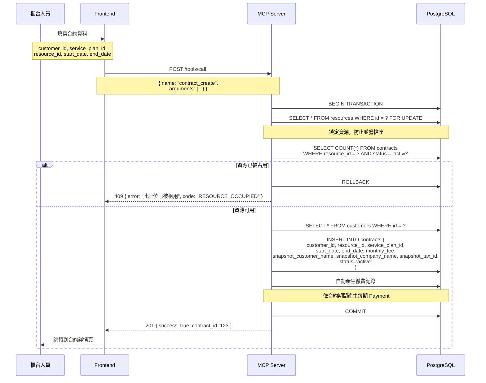
```mermaid
sequenceDiagram
    participant U as 櫃台人員
    participant FE as Frontend
    participant API as MCP Server
    participant DB as PostgreSQL

    U->>FE: 填寫合約資料
    Note over U,FE: customer_id, service_plan_id,<br/>resource_id, start_date, end_date

    FE->>API: POST /tools/call
    Note over FE,API: { name: "contract_create",<br/>arguments: {...} }

    API->>DB: BEGIN TRANSACTION

    API->>DB: SELECT * FROM resources WHERE id = ? FOR UPDATE
    Note over API,DB: 鎖定資源，防止並發搶座

    API->>DB: SELECT COUNT(*) FROM contracts<br/>WHERE resource_id = ? AND status = 'active'

    alt 資源已被占用
        API->>DB: ROLLBACK
        API-->>FE: 409 { error: "此座位已被租用", code: "RESOURCE_OCCUPIED" }
    else 資源可用
        API->>DB: SELECT * FROM customers WHERE id = ?
        API->>DB: INSERT INTO contracts (<br/>  customer_id, resource_id, service_plan_id,<br/>  start_date, end_date, monthly_fee,<br/>  snapshot_customer_name, snapshot_company_name, snapshot_tax_id,<br/>  status='active'<br/>)

        API->>DB: 自動產生繳費紀錄
        Note over API,DB: 依合約期間產生每期 Payment

        API->>DB: COMMIT
        API-->>FE: 201 { success: true, contract_id: 123 }
        FE-->>U: 跳轉到合約詳情頁
    end
```

**座位鎖定規則**

```sql
-- Unique Constraint 防止重複
CREATE UNIQUE INDEX idx_resource_active_contract
ON contracts (resource_id)
WHERE status = 'active' AND resource_id IS NOT NULL;
```

---

### 3.2 TerminateContract（終止合約）

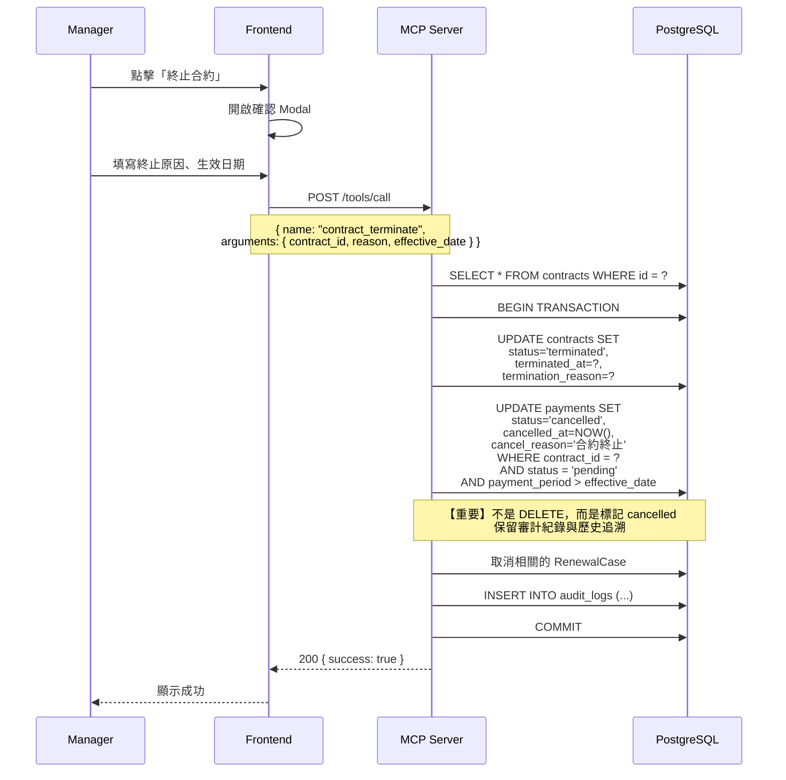
```mermaid
sequenceDiagram
    participant M as Manager
    participant FE as Frontend
    participant API as MCP Server
    participant DB as PostgreSQL

    M->>FE: 點擊「終止合約」
    FE->>FE: 開啟確認 Modal
    M->>FE: 填寫終止原因、生效日期

    FE->>API: POST /tools/call
    Note over FE,API: { name: "contract_terminate",<br/>arguments: { contract_id, reason, effective_date } }

    API->>DB: SELECT * FROM contracts WHERE id = ?

    API->>DB: BEGIN TRANSACTION

    API->>DB: UPDATE contracts SET<br/>status='terminated',<br/>terminated_at=?,<br/>termination_reason=?

    API->>DB: UPDATE payments SET<br/>status='cancelled',<br/>cancelled_at=NOW(),<br/>cancel_reason='合約終止'<br/>WHERE contract_id = ?<br/>AND status = 'pending'<br/>AND payment_period > effective_date
    Note over API,DB: 【重要】不是 DELETE，而是標記 cancelled<br/>保留審計紀錄與歷史追溯

    API->>DB: 取消相關的 RenewalCase
    API->>DB: INSERT INTO audit_logs (...)
    API->>DB: COMMIT

    API-->>FE: 200 { success: true }
    FE-->>M: 顯示成功
```

---

### 3.3 QueryContractDetail（查詢合約詳情 - 導航中心）

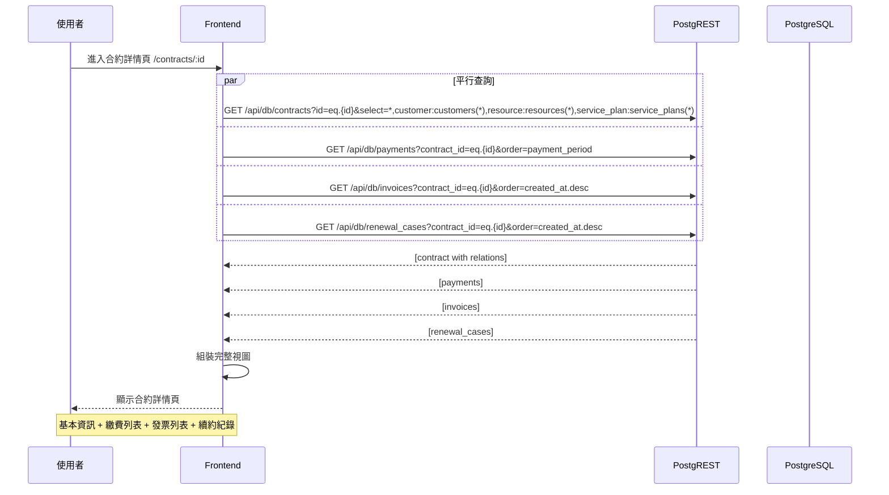
```mermaid
sequenceDiagram
    participant U as 使用者
    participant FE as Frontend
    participant API as PostgREST
    participant DB as PostgreSQL

    U->>FE: 進入合約詳情頁 /contracts/:id

    par 平行查詢
        FE->>API: GET /api/db/contracts?id=eq.{id}&select=*,customer:customers(*),resource:resources(*),service_plan:service_plans(*)
        and
        FE->>API: GET /api/db/payments?contract_id=eq.{id}&order=payment_period
        and
        FE->>API: GET /api/db/invoices?contract_id=eq.{id}&order=created_at.desc
        and
        FE->>API: GET /api/db/renewal_cases?contract_id=eq.{id}&order=created_at.desc
    end

    API-->>FE: [contract with relations]
    API-->>FE: [payments]
    API-->>FE: [invoices]
    API-->>FE: [renewal_cases]

    FE->>FE: 組裝完整視圖
    FE-->>U: 顯示合約詳情頁
    Note over FE,U: 基本資訊 + 繳費列表 + 發票列表 + 續約紀錄
```

**以 Contract 為導航中心的意義**

```
合約詳情頁提供：
├── 基本資訊（客戶、方案、座位、期間）
├── 繳費列表 → 可執行 RecordPayment, WaivePayment
├── 發票列表 → 可執行 IssueInvoice, VoidInvoice
└── 續約紀錄 → 可執行 SendNotification, ConfirmIntent

導航：Contract 是入口
命令：各子域 AR 是主鍵
```

---

## 4. Invoice Domain

### 4.1 IssueInvoice（開立發票）

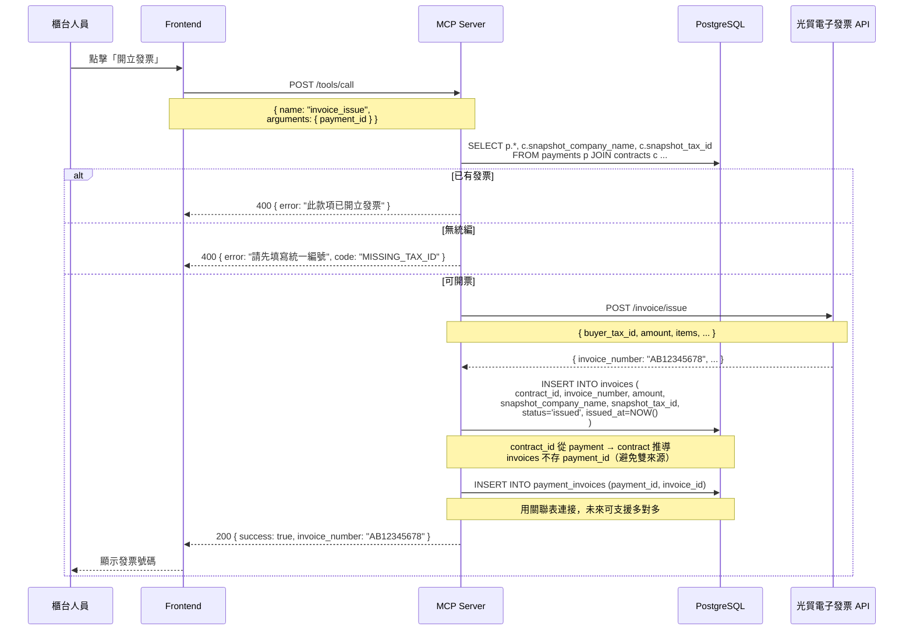
```mermaid
sequenceDiagram
    participant U as 櫃台人員
    participant FE as Frontend
    participant API as MCP Server
    participant DB as PostgreSQL
    participant TAX as 光貿電子發票 API

    U->>FE: 點擊「開立發票」
    FE->>API: POST /tools/call
    Note over FE,API: { name: "invoice_issue",<br/>arguments: { payment_id } }

    API->>DB: SELECT p.*, c.snapshot_company_name, c.snapshot_tax_id<br/>FROM payments p JOIN contracts c ...

    alt 已有發票
        API-->>FE: 400 { error: "此款項已開立發票" }
    else 無統編
        API-->>FE: 400 { error: "請先填寫統一編號", code: "MISSING_TAX_ID" }
    else 可開票
        API->>TAX: POST /invoice/issue
        Note over API,TAX: { buyer_tax_id, amount, items, ... }
        TAX-->>API: { invoice_number: "AB12345678", ... }

        API->>DB: INSERT INTO invoices (<br/>  contract_id, invoice_number, amount,<br/>  snapshot_company_name, snapshot_tax_id,<br/>  status='issued', issued_at=NOW()<br/>)
        Note over API,DB: contract_id 從 payment → contract 推導<br/>invoices 不存 payment_id（避免雙來源）

        API->>DB: INSERT INTO payment_invoices (payment_id, invoice_id)
        Note over API,DB: 用關聯表連接，未來可支援多對多

        API-->>FE: 200 { success: true, invoice_number: "AB12345678" }
        FE-->>U: 顯示發票號碼
    end
```

---

### 4.2 VoidInvoice（作廢發票）

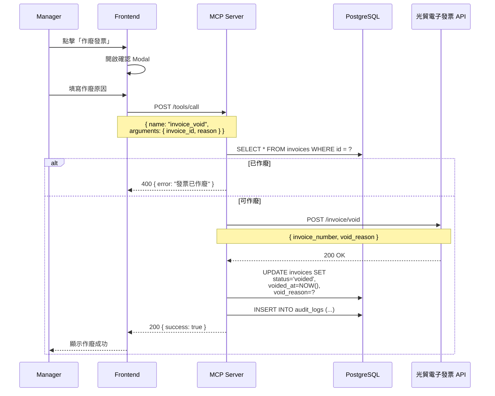
```mermaid
sequenceDiagram
    participant M as Manager
    participant FE as Frontend
    participant API as MCP Server
    participant DB as PostgreSQL
    participant TAX as 光貿電子發票 API

    M->>FE: 點擊「作廢發票」
    FE->>FE: 開啟確認 Modal
    M->>FE: 填寫作廢原因

    FE->>API: POST /tools/call
    Note over FE,API: { name: "invoice_void",<br/>arguments: { invoice_id, reason } }

    API->>DB: SELECT * FROM invoices WHERE id = ?

    alt 已作廢
        API-->>FE: 400 { error: "發票已作廢" }
    else 可作廢
        API->>TAX: POST /invoice/void
        Note over API,TAX: { invoice_number, void_reason }
        TAX-->>API: 200 OK

        API->>DB: UPDATE invoices SET<br/>status='voided',<br/>voided_at=NOW(),<br/>void_reason=?

        API->>DB: INSERT INTO audit_logs (...)

        API-->>FE: 200 { success: true }
        FE-->>M: 顯示作廢成功
    end
```

---

## 5. Termination Domain

### 5.1 CreateTerminationCase（建立解約案件）

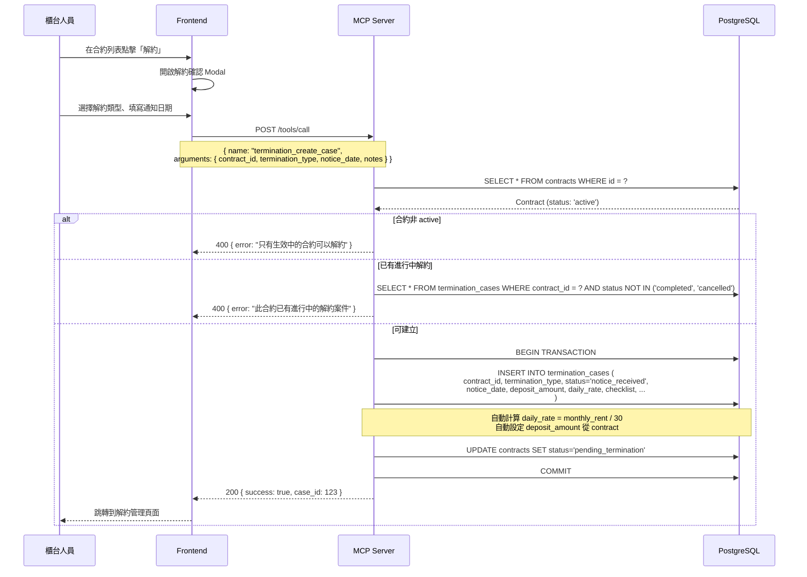
```mermaid
sequenceDiagram
    participant U as 櫃台人員
    participant FE as Frontend
    participant API as MCP Server
    participant DB as PostgreSQL

    U->>FE: 在合約列表點擊「解約」
    FE->>FE: 開啟解約確認 Modal
    U->>FE: 選擇解約類型、填寫通知日期

    FE->>API: POST /tools/call
    Note over FE,API: { name: "termination_create_case",<br/>arguments: { contract_id, termination_type, notice_date, notes } }

    API->>DB: SELECT * FROM contracts WHERE id = ?
    DB-->>API: Contract (status: 'active')

    alt 合約非 active
        API-->>FE: 400 { error: "只有生效中的合約可以解約" }
    else 已有進行中解約
        API->>DB: SELECT * FROM termination_cases WHERE contract_id = ? AND status NOT IN ('completed', 'cancelled')
        API-->>FE: 400 { error: "此合約已有進行中的解約案件" }
    else 可建立
        API->>DB: BEGIN TRANSACTION

        API->>DB: INSERT INTO termination_cases (<br/>contract_id, termination_type, status='notice_received',<br/>notice_date, deposit_amount, daily_rate, checklist, ...<br/>)
        Note over API,DB: 自動計算 daily_rate = monthly_rent / 30<br/>自動設定 deposit_amount 從 contract

        API->>DB: UPDATE contracts SET status='pending_termination'

        API->>DB: COMMIT
        API-->>FE: 200 { success: true, case_id: 123 }
        FE-->>U: 跳轉到解約管理頁面
    end
```

**API 規格**

```yaml
Endpoint: POST /tools/call
Request:
  name: termination_create_case
  arguments:
    contract_id: integer (required)
    termination_type: enum [early, not_renewing, breach] (default: not_renewing)
    notice_date: date (required)
    expected_end_date: date (optional)
    notes: string (optional)

Response (success):
  success: true
  case_id: integer
  contract_id: integer
  status: "notice_received"
```

---

### 5.2 UpdateTerminationStatus（更新解約狀態）

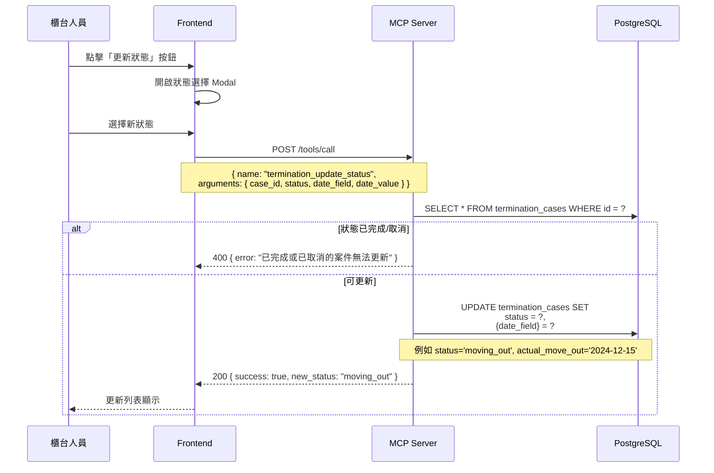
```mermaid
sequenceDiagram
    participant U as 櫃台人員
    participant FE as Frontend
    participant API as MCP Server
    participant DB as PostgreSQL

    U->>FE: 點擊「更新狀態」按鈕
    FE->>FE: 開啟狀態選擇 Modal

    U->>FE: 選擇新狀態
    FE->>API: POST /tools/call
    Note over FE,API: { name: "termination_update_status",<br/>arguments: { case_id, status, date_field, date_value } }

    API->>DB: SELECT * FROM termination_cases WHERE id = ?

    alt 狀態已完成/取消
        API-->>FE: 400 { error: "已完成或已取消的案件無法更新" }
    else 可更新
        API->>DB: UPDATE termination_cases SET<br/>status = ?,<br/>{date_field} = ?
        Note over API,DB: 例如 status='moving_out', actual_move_out='2024-12-15'

        API-->>FE: 200 { success: true, new_status: "moving_out" }
        FE-->>U: 更新列表顯示
    end
```

**狀態轉換規則**

```
notice_received → moving_out → pending_doc → pending_settlement → completed

每次轉換可選擇更新對應日期欄位：
- moving_out: actual_move_out
- pending_doc: doc_submitted_date
- pending_settlement: doc_approved_date
- completed: refund_date
```

---

### 5.3 UpdateChecklist（更新 Checklist）

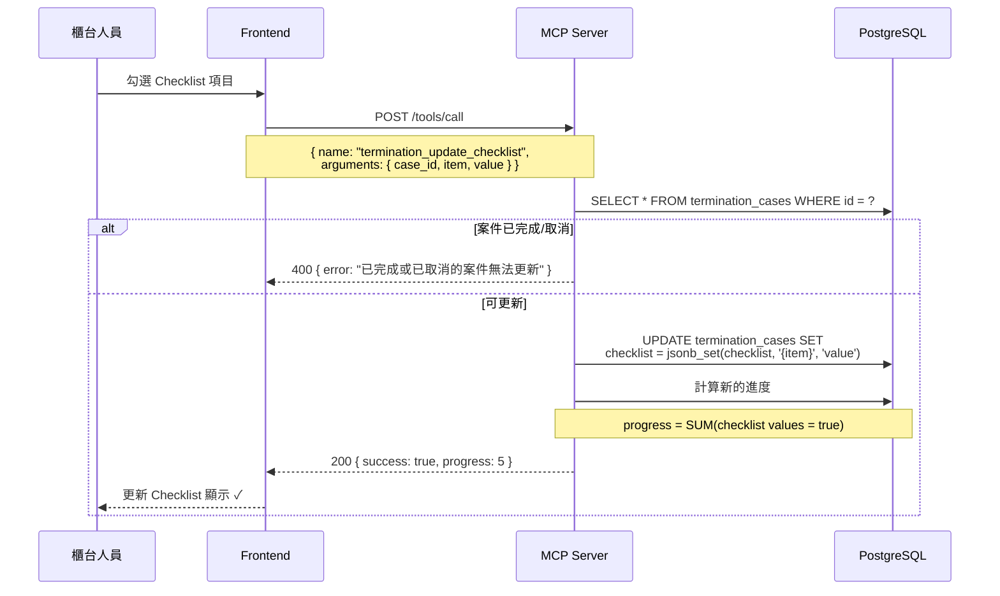
```mermaid
sequenceDiagram
    participant U as 櫃台人員
    participant FE as Frontend
    participant API as MCP Server
    participant DB as PostgreSQL

    U->>FE: 勾選 Checklist 項目
    FE->>API: POST /tools/call
    Note over FE,API: { name: "termination_update_checklist",<br/>arguments: { case_id, item, value } }

    API->>DB: SELECT * FROM termination_cases WHERE id = ?

    alt 案件已完成/取消
        API-->>FE: 400 { error: "已完成或已取消的案件無法更新" }
    else 可更新
        API->>DB: UPDATE termination_cases SET<br/>checklist = jsonb_set(checklist, '{item}', 'value')

        API->>DB: 計算新的進度
        Note over API,DB: progress = SUM(checklist values = true)

        API-->>FE: 200 { success: true, progress: 5 }
        FE-->>U: 更新 Checklist 顯示 ✓
    end
```

**Checklist 項目**

```yaml
- notice_confirmed: 確認收到通知
- belongings_removed: 物品搬離
- keys_returned: 鑰匙歸還
- room_inspected: 場地檢查
- doc_submitted: 公文送件
- doc_approved: 公文核准
- settlement_calculated: 結算計算
- refund_processed: 押金退還
```

---

### 5.4 CalculateSettlement（計算押金結算）

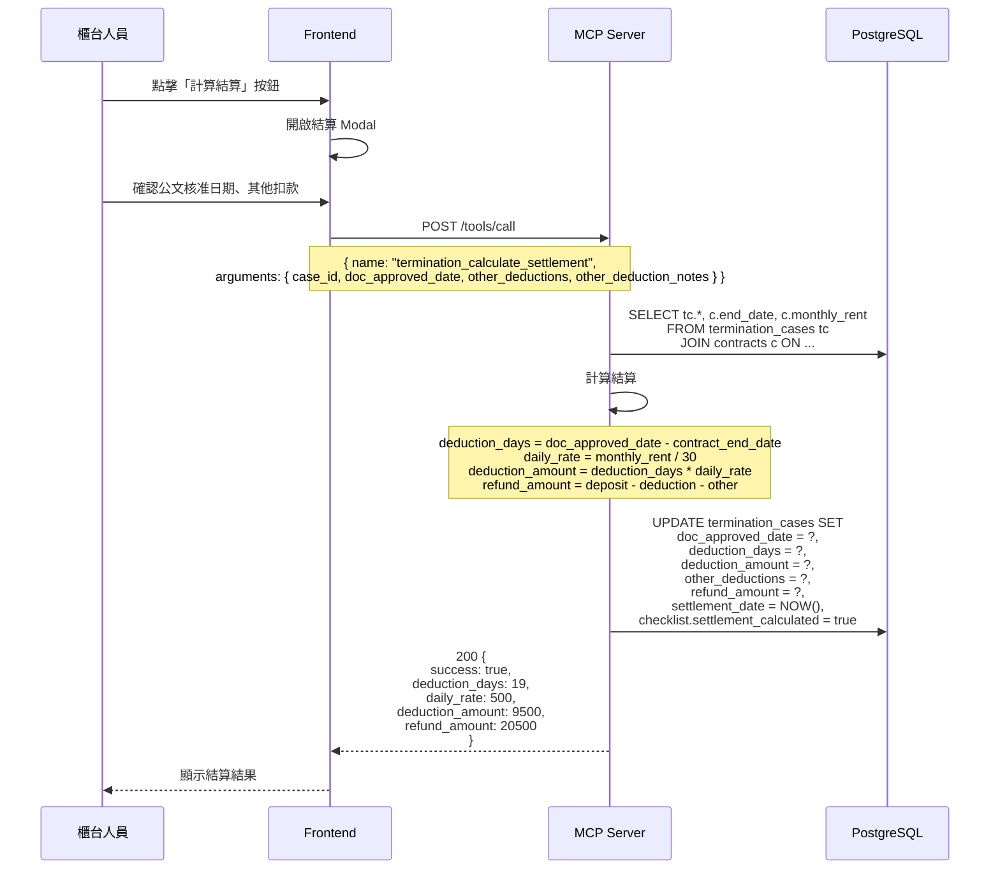
```mermaid
sequenceDiagram
    participant U as 櫃台人員
    participant FE as Frontend
    participant API as MCP Server
    participant DB as PostgreSQL

    U->>FE: 點擊「計算結算」按鈕
    FE->>FE: 開啟結算 Modal

    U->>FE: 確認公文核准日期、其他扣款
    FE->>API: POST /tools/call
    Note over FE,API: { name: "termination_calculate_settlement",<br/>arguments: { case_id, doc_approved_date, other_deductions, other_deduction_notes } }

    API->>DB: SELECT tc.*, c.end_date, c.monthly_rent<br/>FROM termination_cases tc<br/>JOIN contracts c ON ...

    API->>API: 計算結算
    Note over API: deduction_days = doc_approved_date - contract_end_date<br/>daily_rate = monthly_rent / 30<br/>deduction_amount = deduction_days * daily_rate<br/>refund_amount = deposit - deduction - other

    API->>DB: UPDATE termination_cases SET<br/>doc_approved_date = ?,<br/>deduction_days = ?,<br/>deduction_amount = ?,<br/>other_deductions = ?,<br/>refund_amount = ?,<br/>settlement_date = NOW(),<br/>checklist.settlement_calculated = true

    API-->>FE: 200 {<br/>success: true,<br/>deduction_days: 19,<br/>daily_rate: 500,<br/>deduction_amount: 9500,<br/>refund_amount: 20500<br/>}

    FE-->>U: 顯示結算結果
```

**計算公式**

```
扣除天數 = MAX(0, 公文核准日 - 合約到期日)
日租金 = 月租 ÷ 30
扣除金額 = 扣除天數 × 日租金
實際退還 = 押金 - 扣除金額 - 其他扣款
```

---

### 5.5 ProcessRefund（處理退款）

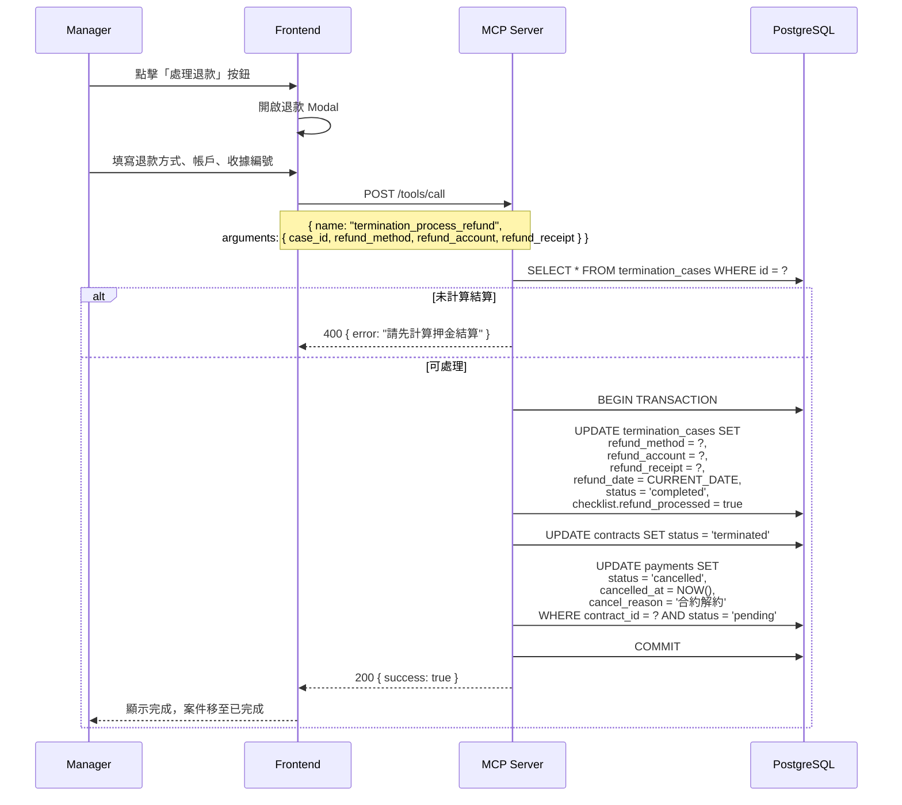
```mermaid
sequenceDiagram
    participant M as Manager
    participant FE as Frontend
    participant API as MCP Server
    participant DB as PostgreSQL

    M->>FE: 點擊「處理退款」按鈕
    FE->>FE: 開啟退款 Modal

    M->>FE: 填寫退款方式、帳戶、收據編號
    FE->>API: POST /tools/call
    Note over FE,API: { name: "termination_process_refund",<br/>arguments: { case_id, refund_method, refund_account, refund_receipt } }

    API->>DB: SELECT * FROM termination_cases WHERE id = ?

    alt 未計算結算
        API-->>FE: 400 { error: "請先計算押金結算" }
    else 可處理
        API->>DB: BEGIN TRANSACTION

        API->>DB: UPDATE termination_cases SET<br/>refund_method = ?,<br/>refund_account = ?,<br/>refund_receipt = ?,<br/>refund_date = CURRENT_DATE,<br/>status = 'completed',<br/>checklist.refund_processed = true

        API->>DB: UPDATE contracts SET status = 'terminated'

        API->>DB: UPDATE payments SET<br/>status = 'cancelled',<br/>cancelled_at = NOW(),<br/>cancel_reason = '合約解約'<br/>WHERE contract_id = ? AND status = 'pending'

        API->>DB: COMMIT
        API-->>FE: 200 { success: true }
        FE-->>M: 顯示完成，案件移至已完成
    end
```

---

### 5.6 CancelTermination（取消解約）

```mermaid
sequenceDiagram
    participant M as Manager
    participant FE as Frontend
    participant API as MCP Server
    participant DB as PostgreSQL

    M->>FE: 點擊「取消解約」按鈕
    FE->>FE: 開啟確認 Modal

    M->>FE: 填寫取消原因
    FE->>API: POST /tools/call
    Note over FE,API: { name: "termination_cancel",<br/>arguments: { case_id, cancel_reason } }

    API->>DB: SELECT * FROM termination_cases WHERE id = ?

    alt 已完成
        API-->>FE: 400 { error: "已完成的解約案件無法取消" }
    else 可取消
        API->>DB: BEGIN TRANSACTION

        API->>DB: UPDATE termination_cases SET<br/>status = 'cancelled',<br/>cancelled_at = NOW(),<br/>cancel_reason = ?

        API->>DB: UPDATE contracts SET status = 'active'
        Note over API,DB: 恢復合約為 active 狀態

        API->>DB: COMMIT
        API-->>FE: 200 { success: true }
        FE-->>M: 顯示取消成功
    end
```

---

## 6. Customer Domain

### 6.1 CreateCustomer（建立客戶）

```mermaid
sequenceDiagram
    participant U as 櫃台人員
    participant FE as Frontend
    participant API as MCP Server
    participant DB as PostgreSQL

    U->>FE: 點擊「新增客戶」
    FE->>FE: 開啟新增 Modal

    U->>FE: 填寫客戶資料
    Note over U,FE: name, phone, email,<br/>company_name, tax_id, address

    FE->>API: POST /tools/call
    Note over FE,API: { name: "customer_create",<br/>arguments: { name, phone, email, ... } }

    API->>DB: SELECT * FROM customers WHERE phone = ? OR email = ?

    alt 電話或 Email 重複
        API-->>FE: 409 { error: "客戶已存在", code: "DUPLICATE_CUSTOMER" }
    else 可建立
        API->>DB: INSERT INTO customers (name, phone, email, ...)
        API-->>FE: 200 { success: true, customer_id: 123 }
        FE-->>U: 關閉 Modal，刷新列表
    end
```

---

### 6.2 UpdateCustomer（更新客戶）

```mermaid
sequenceDiagram
    participant U as 櫃台人員
    participant FE as Frontend
    participant API as PostgREST
    participant DB as PostgreSQL

    U->>FE: 點擊「編輯」按鈕
    FE->>FE: 開啟編輯 Modal，載入現有資料

    U->>FE: 修改客戶資料
    FE->>API: PATCH /api/db/customers?id=eq.{id}
    Note over FE,API: { name, phone, email, company_name, tax_id, address }

    API->>DB: UPDATE customers SET ... WHERE id = ?
    API-->>FE: 200 (更新成功)
    FE-->>U: 關閉 Modal，刷新列表
```

---

### 6.3 LinkLineUser（綁定 LINE）

```mermaid
sequenceDiagram
    participant C as 客戶
    participant LINE as LINE App
    participant API as MCP Server
    participant DB as PostgreSQL

    Note over C,DB: 客戶收到館方訊息，點擊「綁定帳號」

    C->>LINE: 點擊 Flex Message 中的綁定按鈕
    LINE->>API: GET /line/liff/bind?token={token}

    API->>API: 驗證 LIFF token
    API->>DB: SELECT line_user_id FROM LIFF context

    API->>FE: 返回綁定頁面
    C->>FE: 輸入手機號碼驗證
    FE->>API: POST /tools/call
    Note over FE,API: { name: "customer_link_line",<br/>arguments: { phone, line_user_id } }

    API->>DB: SELECT * FROM customers WHERE phone = ?

    alt 客戶不存在
        API-->>FE: 404 { error: "找不到此手機號碼的客戶" }
    else 已綁定其他帳號
        API-->>FE: 409 { error: "此 LINE 帳號已綁定其他客戶" }
    else 可綁定
        API->>DB: UPDATE customers SET line_user_id = ? WHERE id = ?
        API-->>FE: 200 { success: true }
        FE-->>C: 顯示綁定成功
    end
```

---

## 7. Booking Domain

### 7.1 CreateBooking（建立會議室預約）

```mermaid
sequenceDiagram
    participant U as 使用者
    participant FE as Frontend
    participant API as MCP Server
    participant DB as PostgreSQL

    U->>FE: 選擇日期、時段、會議室
    FE->>FE: 顯示可用時段

    U->>FE: 確認預約
    FE->>API: POST /tools/call
    Note over FE,API: { name: "booking_create",<br/>arguments: { resource_id, date, start_time, end_time, customer_id, notes } }

    API->>DB: SELECT * FROM bookings<br/>WHERE resource_id = ?<br/>AND date = ?<br/>AND (start_time, end_time) OVERLAPS (?, ?)

    alt 時段已被預約
        API-->>FE: 409 { error: "此時段已被預約", code: "TIME_CONFLICT" }
    else 可預約
        API->>DB: INSERT INTO bookings (<br/>resource_id, customer_id, date,<br/>start_time, end_time, status='confirmed'<br/>)

        API-->>FE: 200 { success: true, booking_id: 456 }
        FE-->>U: 顯示預約成功
    end
```

**預約時段衝突檢查**

```sql
-- 檢查時段是否重疊
SELECT EXISTS (
    SELECT 1 FROM bookings
    WHERE resource_id = $1
    AND date = $2
    AND status NOT IN ('cancelled')
    AND (start_time, end_time) OVERLAPS ($3, $4)
)
```

---

### 7.2 CancelBooking（取消預約）

```mermaid
sequenceDiagram
    participant U as 使用者
    participant FE as Frontend
    participant API as MCP Server
    participant DB as PostgreSQL

    U->>FE: 點擊「取消預約」
    FE->>FE: 開啟確認 Modal

    U->>FE: 確認取消
    FE->>API: POST /tools/call
    Note over FE,API: { name: "booking_cancel",<br/>arguments: { booking_id, reason } }

    API->>DB: SELECT * FROM bookings WHERE id = ?

    alt 預約已完成或已取消
        API-->>FE: 400 { error: "無法取消此預約" }
    else 可取消
        API->>DB: UPDATE bookings SET<br/>status='cancelled',<br/>cancelled_at=NOW(),<br/>cancel_reason=?

        API-->>FE: 200 { success: true }
        FE-->>U: 更新列表
    end
```

---

### 7.3 CheckInBooking（預約報到）

```mermaid
sequenceDiagram
    participant U as 櫃台人員
    participant FE as Frontend
    participant API as MCP Server
    participant DB as PostgreSQL

    U->>FE: 點擊「報到」按鈕
    FE->>API: POST /tools/call
    Note over FE,API: { name: "booking_checkin",<br/>arguments: { booking_id } }

    API->>DB: SELECT * FROM bookings WHERE id = ?

    alt 預約狀態不正確
        API-->>FE: 400 { error: "無法報到此預約" }
    else 可報到
        API->>DB: UPDATE bookings SET<br/>status='checked_in',<br/>checked_in_at=NOW()

        API-->>FE: 200 { success: true, checked_in_at: "..." }
        FE-->>U: 更新狀態顯示
    end
```

---

## 8. Quote Domain

### 8.1 CreateQuote（建立報價單）

```mermaid
sequenceDiagram
    participant U as 業務人員
    participant FE as Frontend
    participant API as MCP Server
    participant DB as PostgreSQL

    U->>FE: 點擊「新增報價」
    FE->>FE: 開啟報價表單

    U->>FE: 填寫報價資訊
    Note over U,FE: prospect_id, service_plan_id,<br/>resource_id, start_date, discount, notes

    FE->>API: POST /tools/call
    Note over FE,API: { name: "quote_create",<br/>arguments: { prospect_id, service_plan_id, ... } }

    API->>DB: SELECT * FROM service_plans WHERE id = ?
    API->>API: 計算報價金額（含折扣）

    API->>DB: INSERT INTO quotes (<br/>quote_number, prospect_id, service_plan_id,<br/>monthly_fee, discount, final_price,<br/>valid_until, status='draft'<br/>)
    Note over API,DB: quote_number = 'HJ-Q-' + YYYYMM + 序號

    API-->>FE: 200 { success: true, quote_id: 789, quote_number: "HJ-Q-202412-001" }
    FE-->>U: 跳轉到報價詳情頁
```

---

### 8.2 SendQuote（發送報價單）

```mermaid
sequenceDiagram
    participant U as 業務人員
    participant FE as Frontend
    participant API as MCP Server
    participant DB as PostgreSQL
    participant LINE as LINE API

    U->>FE: 點擊「發送報價」
    FE->>API: POST /tools/call
    Note over FE,API: { name: "quote_send",<br/>arguments: { quote_id } }

    API->>DB: SELECT q.*, p.line_user_id, p.email<br/>FROM quotes q JOIN prospects p ...

    alt LINE 已綁定
        API->>LINE: POST /v2/bot/message/push
        Note over API,LINE: Flex Message 含報價詳情 + 公開連結
    else 有 Email
        API->>API: 發送 Email（含公開連結）
    else 無聯絡方式
        API-->>FE: 400 { error: "此潛在客戶無可用的聯絡方式" }
    end

    API->>DB: UPDATE quotes SET<br/>status='sent',<br/>sent_at=NOW()

    API-->>FE: 200 { success: true, public_url: "..." }
    FE-->>U: 顯示發送成功 + 公開連結
```

**公開連結格式**：`https://hj.yourspce.org/quote/{quote_number}`

---

### 8.3 ConvertQuoteToContract（報價轉合約）

```mermaid
sequenceDiagram
    participant U as 業務人員
    participant FE as Frontend
    participant API as MCP Server
    participant DB as PostgreSQL

    U->>FE: 點擊「轉為合約」
    FE->>FE: 開啟確認 Modal

    U->>FE: 確認轉換
    FE->>API: POST /tools/call
    Note over FE,API: { name: "quote_convert",<br/>arguments: { quote_id } }

    API->>DB: SELECT * FROM quotes WHERE id = ?

    alt 報價已過期
        API-->>FE: 400 { error: "報價已過期", code: "QUOTE_EXPIRED" }
    else 已有合約
        API-->>FE: 400 { error: "此報價已轉換為合約" }
    else 可轉換
        API->>DB: BEGIN TRANSACTION

        API->>DB: SELECT * FROM prospects WHERE id = quote.prospect_id

        alt 客戶不存在
            API->>DB: INSERT INTO customers (...) -- 從 prospect 建立
        end

        API->>DB: INSERT INTO contracts (<br/>customer_id, service_plan_id, resource_id,<br/>monthly_fee, start_date, end_date,<br/>status='active'<br/>)
        Note over API,DB: 從 quote 複製價格方案資訊

        API->>DB: UPDATE quotes SET<br/>status='converted',<br/>converted_at=NOW(),<br/>contract_id=?

        API->>DB: UPDATE prospects SET status='converted'

        API->>DB: COMMIT
        API-->>FE: 200 { success: true, contract_id: 123 }
        FE-->>U: 跳轉到合約詳情頁
    end
```

---

## 9. LegalLetter Domain

### 9.1 CreateLegalLetter（建立存證信函）

```mermaid
sequenceDiagram
    participant U as 櫃台人員
    participant FE as Frontend
    participant API as MCP Server
    participant DB as PostgreSQL

    U->>FE: 點擊「建立存證信函」
    FE->>FE: 開啟建立 Modal

    U->>FE: 選擇合約/客戶、填寫內容
    Note over U,FE: contract_id, letter_type,<br/>content, send_date

    FE->>API: POST /tools/call
    Note over FE,API: { name: "legal_letter_create",<br/>arguments: { contract_id, letter_type, content } }

    API->>DB: SELECT * FROM contracts c<br/>JOIN customers cust ON ...

    API->>API: 生成存證信函編號
    Note over API: letter_number = 'LL-' + YYYYMMDD + 序號

    API->>DB: INSERT INTO legal_letters (<br/>letter_number, contract_id, customer_id,<br/>letter_type, content, status='draft'<br/>)

    API-->>FE: 200 { success: true, letter_id: 101, letter_number: "LL-20241225-001" }
    FE-->>U: 顯示建立成功
```

**存證信函類型**

| letter_type | 說明 |
|-------------|------|
| payment_notice | 催繳通知 |
| termination_warning | 解約警告 |
| final_notice | 最後通牒 |
| legal_action | 法律行動預告 |

---

### 9.2 SendLegalLetter（發送存證信函）

```mermaid
sequenceDiagram
    participant U as 櫃台人員
    participant FE as Frontend
    participant API as MCP Server
    participant DB as PostgreSQL
    participant PDF as PDF Generator
    participant MAIL as 郵寄服務

    U->>FE: 點擊「發送」
    FE->>FE: 開啟確認 Modal

    U->>FE: 選擇發送方式（電子/郵寄）
    FE->>API: POST /tools/call
    Note over FE,API: { name: "legal_letter_send",<br/>arguments: { letter_id, send_method } }

    API->>DB: SELECT * FROM legal_letters WHERE id = ?

    alt 已發送
        API-->>FE: 400 { error: "此存證信函已發送" }
    else 可發送
        API->>PDF: 生成 PDF 檔案
        PDF-->>API: PDF URL

        API->>DB: UPDATE legal_letters SET<br/>pdf_url=?,<br/>status='sent',<br/>sent_at=NOW(),<br/>send_method=?

        API->>DB: INSERT INTO notification_logs (<br/>type='legal_letter',<br/>reference_id=letter_id<br/>)

        alt 郵寄
            API->>MAIL: 觸發郵寄流程
            Note over API,MAIL: 記錄郵寄追蹤號
        end

        API-->>FE: 200 { success: true, pdf_url: "..." }
        FE-->>U: 顯示發送成功 + PDF 連結
    end
```

---

## 10. 查詢 API 彙整

### 10.1 PostgREST 直接查詢

| 用途 | Endpoint | 說明 |
|------|----------|------|
| 客戶列表 | `GET /api/db/v_customer_summary` | View 包含合約統計 |
| 繳費列表 | `GET /api/db/v_payments_due` | View 包含客戶、合約資訊 |
| 逾期列表 | `GET /api/db/v_overdue_details` | View 包含逾期天數 |
| 續約列表 | `GET /api/db/v_renewal_reminders` | View 包含 Checklist 狀態 |
| 分館營收 | `GET /api/db/v_branch_revenue` | View 彙整各分館數據 |
| 合約詳情 | `GET /api/db/contracts?id=eq.{id}&select=*,customer:customers(*)` | 含關聯 |

### 10.2 MCP Tools 命令

| Domain | Tool Name | 說明 |
|--------|-----------|------|
| Billing | `billing_record_payment` | 記錄繳費 |
| Billing | `billing_request_waive` | 申請免收 |
| Billing | `billing_approve_waive` | 核准免收 |
| Billing | `billing_reject_waive` | 駁回免收 |
| Billing | `billing_undo_payment` | 撤銷繳費 |
| Billing | `billing_send_reminder` | 發送催繳（內部呼叫 LINE） |
| Billing | `billing_batch_remind` | 批量催繳 |
| Renewal | `renewal_send_notification` | 發送續約通知（內部呼叫 LINE） |
| Renewal | `renewal_confirm_intent` | 確認續約意願 |
| Renewal | `renewal_cancel` | 取消續約 |
| Renewal | `renewal_complete` | 完成續約 |
| Contract | `contract_create` | 建立合約 |
| Contract | `contract_terminate` | 終止合約（payments 標記 cancelled） |
| Invoice | `invoice_issue` | 開立發票 |
| Invoice | `invoice_void` | 作廢發票 |
| Termination | `termination_create_case` | 建立解約案件 |
| Termination | `termination_update_status` | 更新解約狀態 |
| Termination | `termination_update_checklist` | 更新 Checklist |
| Termination | `termination_calculate_settlement` | 計算押金結算 |
| Termination | `termination_process_refund` | 處理退款 |
| Termination | `termination_cancel` | 取消解約 |
| Customer | `customer_create` | 建立客戶 |
| Customer | `customer_link_line` | 綁定 LINE |
| Booking | `booking_create` | 建立預約 |
| Booking | `booking_cancel` | 取消預約 |
| Booking | `booking_checkin` | 預約報到 |
| Quote | `quote_create` | 建立報價單 |
| Quote | `quote_send` | 發送報價單 |
| Quote | `quote_convert` | 報價轉合約 |
| LegalLetter | `legal_letter_create` | 建立存證信函 |
| LegalLetter | `legal_letter_send` | 發送存證信函 |

> **設計原則**：
> - 前端不需知道通知管道（LINE/SMS/Email），由後端決定
> - 所有狀態變更透過 MCP Tools，不直接 PATCH 資料庫
> - 簡單的 CRUD 操作可使用 PostgREST 直接查詢

---

## 11. 錯誤碼定義

| Code | HTTP Status | 說明 |
|------|-------------|------|
| `INVALID_STATUS` | 400 | 操作不符合當前狀態 |
| `RESOURCE_OCCUPIED` | 409 | 資源已被占用 |
| `LINE_NOT_BOUND` | 400 | 客戶未綁定 LINE |
| `MISSING_TAX_ID` | 400 | 缺少統一編號 |
| `ALREADY_EXISTS` | 409 | 重複建立（如已有 pending waive request） |
| `NOT_FOUND` | 404 | 資源不存在 |
| `PERMISSION_DENIED` | 403 | 權限不足 |
| `CHECKLIST_INCOMPLETE` | 400 | Checklist 未完成 |

---

## 附錄：前端 State 設計建議

```typescript
// 統一的 Action State
interface ActionState {
  targetId: string | null
  targetType: 'payment' | 'renewal_case' | 'invoice' | 'contract' | null
  actionType: string | null  // 'record', 'waive', 'undo', 'remind', ...
  status: 'idle' | 'confirming' | 'processing' | 'success' | 'error'
  error: string | null
}

// 使用範例
const [action, setAction] = useState<ActionState>({
  targetId: null,
  targetType: null,
  actionType: null,
  status: 'idle',
  error: null
})

// 開啟 Modal
const startAction = (targetId: string, targetType: string, actionType: string) => {
  setAction({ targetId, targetType, actionType, status: 'confirming', error: null })
}

// 執行
const executeAction = async () => {
  setAction(prev => ({ ...prev, status: 'processing' }))
  try {
    await callTool(`${action.targetType}_${action.actionType}`, { [`${action.targetType}_id`]: action.targetId })
    setAction(prev => ({ ...prev, status: 'success' }))
  } catch (e) {
    setAction(prev => ({ ...prev, status: 'error', error: e.message }))
  }
}

// 關閉
const resetAction = () => {
  setAction({ targetId: null, targetType: null, actionType: null, status: 'idle', error: null })
}
```
