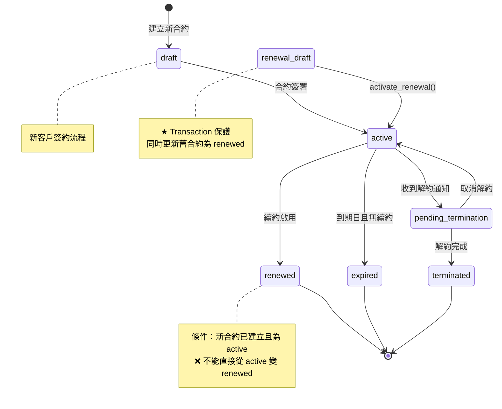

# 合約狀態轉換圖 (State Transition Diagram)

> Version: 1.0
> Date: 2025-12-26

---

## 狀態定義

| 狀態 | 說明 | 業務影響 |
|------|------|---------|
| `draft` | 草稿（新建合約用） | 不產生應收帳款 |
| `renewal_draft` | 續約草稿 | 不產生應收帳款，不影響舊合約 |
| `active` | 生效中 | 產生應收帳款 |
| `expired` | 已到期 | 停止產生新應收 |
| `renewed` | 已續約（被新合約取代） | 停止產生新應收 |
| `pending_termination` | 解約中 | 產生應收但標記解約中 |
| `terminated` | 已終止 | 停止產生新應收 |

---

## 狀態轉換圖



---

## 合法狀態轉換矩陣

| 從 \ 到 | draft | renewal_draft | active | expired | renewed | pending_termination | terminated |
|---------|-------|---------------|--------|---------|---------|---------------------|------------|
| `draft` | - | ❌ | ✅ 簽署 | ❌ | ❌ | ❌ | ❌ |
| `renewal_draft` | ❌ | - | ✅ activate | ❌ | ❌ | ❌ | ✅ cancel |
| `active` | ❌ | ❌ | - | ✅ 到期 | ✅ 續約* | ✅ 解約 | ❌ |
| `expired` | ❌ | ❌ | ❌ | - | ❌ | ❌ | ❌ |
| `renewed` | ❌ | ❌ | ❌ | ❌ | - | ❌ | ❌ |
| `pending_termination` | ❌ | ❌ | ✅ 取消 | ❌ | ❌ | - | ✅ 完成 |
| `terminated` | ❌ | ❌ | ❌ | ❌ | ❌ | ❌ | - |

> *注意：`active → renewed` 必須透過 `activate_renewal()` Transaction，確保新合約同時變為 active

---

## 關鍵規則

### 1. 續約流程

```
舊合約 (active) ──────────────────────────────────────┐
                                                      │
                renewal_create_draft()                │
                         │                            │
                         ▼                            │
              新合約 (renewal_draft)                  │
                         │                            │
                 activate_renewal()                   │
                    Transaction                       │
               ┌─────────┴──────────┐                 │
               ▼                    ▼                 │
    新合約 (active)      舊合約 (renewed) ←───────────┘
```

**規則**：
- 舊合約只能在新合約成功啟用後才能變成 `renewed`
- 兩個操作必須在同一 Transaction 內
- 任何失敗都會回滾，不會出現「半成品」

### 2. 解約流程

```
active → pending_termination → terminated
   │              │
   │              ▼
   │         可取消回 active
   │
   └─────→ 不能直接變 terminated
```

**規則**：
- 必須經過 `pending_termination` 中間狀態
- 解約完成時，所有待繳款項需同步處理（Transaction）

### 3. 禁止的轉換

| 非法操作 | 原因 |
|----------|------|
| `active → renewed` 直接轉換 | 必須確認新合約存在 |
| `draft → renewed` | 還沒生效過 |
| `terminated → active` | 已終止不可復活 |
| `expired → active` | 需建立新合約 |

---

## 後端驗證點

每個狀態轉換都必須在**後端**驗證：

```python
# 範例：activate_renewal() 內的檢查
def activate_renewal(new_contract_id):
    new_contract = get_contract(new_contract_id)

    # 狀態檢查
    if new_contract.status != 'renewal_draft':
        raise ValueError("只能啟用 renewal_draft 狀態的合約")

    old_contract = get_contract(new_contract.renewed_from_id)

    if old_contract.status != 'active':
        raise ValueError("原合約必須是 active 狀態")

    # Transaction 內執行
    with db.transaction():
        update_status(new_contract_id, 'active')
        update_status(old_contract.id, 'renewed')
```

---

## 應收帳款關聯

| 狀態 | generate_monthly_payments() 處理 |
|------|----------------------------------|
| `draft` | ❌ 忽略 |
| `renewal_draft` | ❌ 忽略 |
| `active` | ✅ 產生應收 |
| `expired` | ❌ 忽略 |
| `renewed` | ❌ 忽略 |
| `pending_termination` | ⚠️ 視解約日期 |
| `terminated` | ❌ 忽略 |

---

## 相關文件

- [SSD-v1.5-renewal-draft.md](SSD-v1.5-renewal-draft.md) - 續約草稿 API 規格
- [PRD-v2.5-data-consistency.md](PRD-v2.5-data-consistency.md) - 資料一致性問題
- [DESIGN-CHECKLIST.md](DESIGN-CHECKLIST.md) - 設計審查清單
