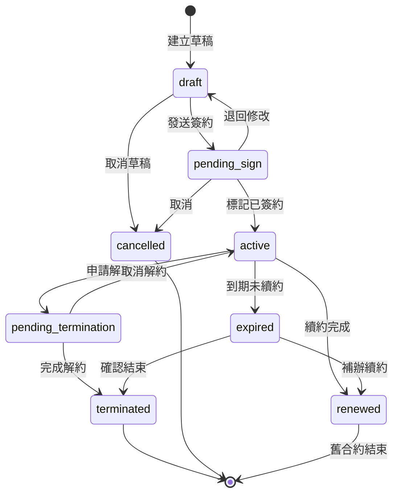

# 合約生命週期狀態機

> 最後更新：2025-12-31

## 狀態圖

## 狀態定義

| 狀態 | 說明 | 可執行操作 |
|------|------|-----------|
| `draft` | 草稿，尚未發送簽約 | 編輯、發送簽約、取消 |
| `pending_sign` | 待簽約，已發送給客戶 | 標記已簽、退回修改、取消 |
| `active` | 生效中 | 申請解約、到期處理 |
| `pending_termination` | 待解約，已提交解約申請 | 完成解約、取消解約 |
| `expired` | 已過期，未處理 | 續約、確認結束 |
| `renewed` | 已續約，舊合約結束 | 唯讀 |
| `terminated` | 已解約 | 唯讀 |
| `cancelled` | 已取消（草稿階段） | 唯讀 |

## 狀態轉移條件

| 從 | 到 | 觸發條件 | 唯一寫入入口 |
|----|----|---------|--------------|
| `draft` | `pending_sign` | 手動發送簽約 | `renewal_send_for_sign` |
| `draft` | `cancelled` | 手動取消 | `renewal_cancel_draft` |
| `pending_sign` | `active` | 確認客戶已簽約 | `renewal_mark_signed` |
| `pending_sign` | `draft` | 需要修改內容 | `renewal_update_draft` |
| `active` | `pending_termination` | 提交解約申請 | `complete_termination_atomic` RPC |
| `active` | `expired` | 系統自動（end_date < today） | Cron / View 計算 |
| `active` | `renewed` | 續約合約啟用 | `renewal_activate` (舊合約自動更新) |
| `pending_termination` | `terminated` | 完成解約流程 | `complete_termination_atomic` RPC |
| `pending_termination` | `active` | 取消解約申請 | `cancel_termination_atomic` RPC |
| `expired` | `renewed` | 補辦續約 | `renewal_activate` |
| `expired` | `terminated` | 確認客戶不續約 | 手動更新 |

## 連鎖反應

### `draft` → `active`（簽約完成）

1. 合約狀態更新為 `active`
2. `signed_at` 寫入時間戳
3. 建立首期 Payment 記錄（由 Trigger 處理）
4. 建立 Commission 記錄（由 Trigger 處理）

### `active` → `renewed`（續約完成）

1. 舊合約狀態更新為 `renewed`
2. 舊合約 `renewed_to_id` 指向新合約
3. 新合約 `renewed_from_id` 指向舊合約
4. 新合約 `contract_period` = 舊合約 + 1
5. 新合約沿用 `contract_number`

### `active` → `terminated`（解約完成）

1. 合約狀態更新為 `terminated`
2. `termination_cases` 記錄更新為 `completed`
3. 剩餘 Payment 記錄標記為 `cancelled`
4. 座位釋放（position 可重新分配）

## 注意事項

- **expired 不是終態**：過期合約仍可續約或確認結束
- **renewed 是舊合約的終態**：新合約會有獨立生命週期
- **狀態檢查在後端**：前端只發送意圖，狀態驗證由 RPC/Tool 處理
- **不可跳躍**：必須按順序轉移，不能從 draft 直接到 active
