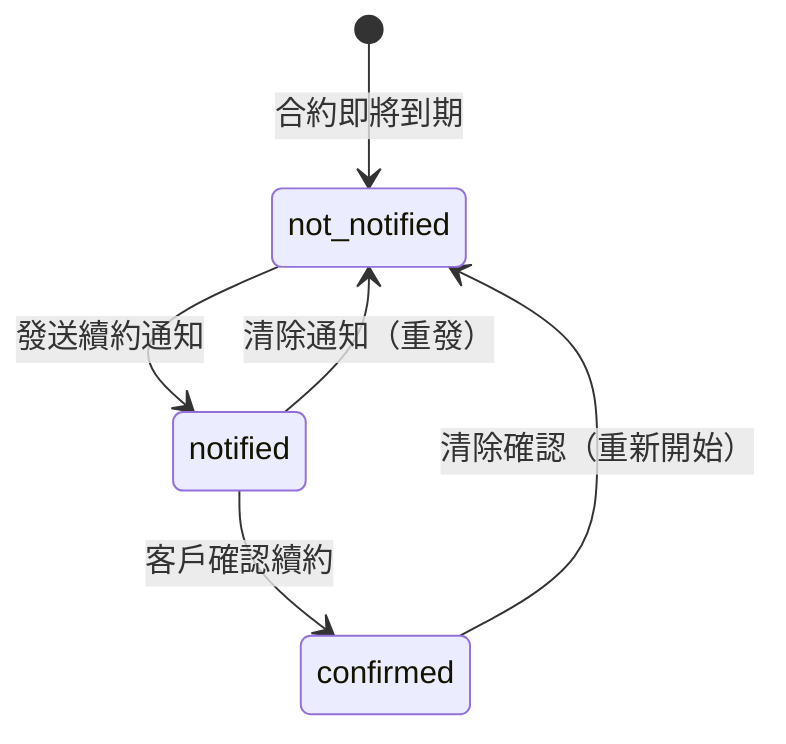
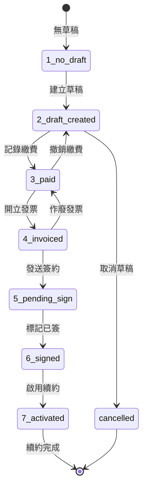

# 續約流程狀態機

> 最後更新：2025-12-31

## V3 架構概覽

續約流程分為兩條獨立的線：

```
意願線（Intent Line）          交易線（Transaction Line）
────────────────────          ──────────────────────────
通知 → 確認                    草稿 → 繳費 → 開票 → 簽約 → 啟用
   ↓      ↓                        ↓      ↓      ↓      ↓
set_renewal_intent            renewal_create_draft
                              billing_record_payment
                              invoice_create_v2
                              renewal_mark_signed
                              renewal_activate
```

## 意願線狀態圖



### 意願線欄位

| 欄位 | 說明 | 寫入工具 |
|------|------|---------|
| `renewal_notified_at` | 通知發送時間 | `set_renewal_intent(intent_type='notified')` |
| `renewal_confirmed_at` | 客戶確認時間 | `set_renewal_intent(intent_type='confirmed')` |

### 意願線 View

```sql
SELECT * FROM v_renewal_intent WHERE contract_id = ?;
-- 回傳：is_notified, is_confirmed, notified_at, confirmed_at
```

## 交易線狀態圖（7 步驟）



### 交易線 7 步驟詳解

| 步驟 | 狀態 | 說明 | 唯一寫入入口 |
|------|------|------|--------------|
| 1 | `no_draft` | 尚未開始續約交易 | - |
| 2 | `draft_created` | 已建立續約草稿 | `renewal_create_draft` |
| 3 | `paid` | 已收到續約款 | `billing_record_payment` |
| 4 | `invoiced` | 已開立發票 | `invoice_create_v2` |
| 5 | `pending_sign` | 已發送簽約 | `renewal_send_for_sign` |
| 6 | `signed` | 客戶已簽約 | `renewal_mark_signed` |
| 7 | `activated` | 續約合約已啟用 | `renewal_activate` |

### 交易線 View

```sql
SELECT * FROM v_contract_workspace WHERE id = ?;
-- 回傳：timeline_payment_status, timeline_invoice_status, timeline_signing_status, etc.
```

## Decision Table（決策表）

| 當前狀態 | 卡在 | 下一步 | 負責人 |
|---------|------|--------|--------|
| `draft_created` | 未繳費 | 催繳或記錄繳費 | 業務 |
| `paid` | 未開票 | 開立發票 | 會計 |
| `invoiced` | 未發送簽約 | 發送簽約 | 業務 |
| `pending_sign` | 未簽約 | 提醒客戶簽約 | 業務 |
| `signed` | 未啟用 | 啟用續約 | 系統/管理者 |

## 兩線整合

```
意願線                    交易線
────────                  ────────
通知 ──┐
       │
確認 ──┼──→ 建立草稿 → 繳費 → 開票 → 簽約 → 啟用
       │
       └──→ （確認後才能建立草稿）
```

### 建立草稿的前置條件

1. 合約狀態為 `active` 或 `expired`（30 天內）
2. 無現有草稿（或現有草稿已取消）
3. **不強制**：意願確認（`is_confirmed`）- 業務可自行判斷

## 注意事項

- **意願線是可選的**：可以不通知/確認就直接建立草稿
- **交易線是必須的**：必須完成 7 步驟才算續約完成
- **兩線獨立管理**：意願用 `intent_tools`，交易用 `renewal_tools_v3`
- **SSOT 設計**：繳費/開票狀態由各自系統管理，Workspace View 聚合顯示
